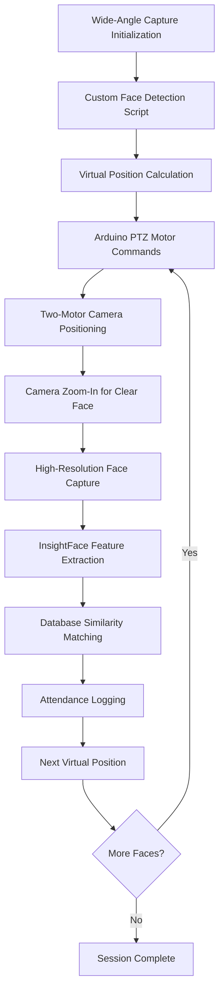

# Advanced Intelligent Face Recognition-Based University Attendance Management System
## Comprehensive Project Methodology and Technical Documentation

---

## Executive Summary

This document presents a comprehensive methodology for the development and implementation of an Advanced Intelligent Face Recognition-Based University Attendance Management System. The system integrates cutting-edge computer vision technologies, automated hardware control, and sophisticated database management to provide a fully automated, accurate, and scalable solution for academic attendance tracking.

The system employs a novel multi-stage approach utilizing custom face detection scripts with virtual position calculation, Arduino-controlled two-motor PTZ mechanisms, and advanced InsightFace recognition algorithms to achieve unprecedented accuracy and automation in attendance management.

## **Key Implementation Steps:**

1. **Wide-Angle Capture**: Camera captures classroom overview image
2. **Custom Face Detection**: Local script detects faces and calculates virtual positions
3. **Virtual Position Mapping**: Converts face locations to precise coordinate points
4. **Arduino PTZ Control**: Two stepper motors position camera using calculated angles
5. **Zoomed Face Capture**: Camera zooms in for high-resolution face images
6. **InsightFace Recognition**: AI model extracts and matches facial features
7. **Automated Attendance**: System logs attendance with confidence scores

---

## 1. Project Overview

### 1.1 Project Title
**Advanced Intelligent Face Recognition-Based University Attendance Management System with Automated Camera Control and Multi-Stage Detection Pipeline**

### 1.2 Project Scope and Objectives

#### Primary Objective
To develop and deploy a fully autonomous, high-precision attendance management system that eliminates manual intervention while providing comprehensive analytics and administrative oversight for academic institutions.

#### Secondary Objectives
- **Automation Excellence**: Achieve 100% automated attendance capture without human intervention
- **Precision Enhancement**: Implement multi-stage detection pipeline for maximum accuracy
- **Hardware Integration**: Seamlessly integrate camera control, positioning systems, and embedded controllers
- **Scalability**: Design architecture capable of handling multiple simultaneous classroom sessions
- **Analytics Intelligence**: Provide real-time insights and predictive analytics for academic performance

### 1.3 Problem Analysis and Justification

#### Current System Limitations
1. **Manual Dependency**: Traditional systems require continuous human oversight and intervention
2. **Accuracy Deficiencies**: Single-shot recognition systems suffer from lighting, angle, and distance variations
3. **Scalability Constraints**: Limited ability to monitor multiple students simultaneously
4. **Technological Gaps**: Lack of integration between hardware positioning and software recognition
5. **Data Fragmentation**: Insufficient correlation between attendance patterns and academic performance

#### Innovation Drivers
- **Industry 4.0 Integration**: Leveraging IoT, AI, and embedded systems for educational transformation
- **Precision Requirements**: Academic institutions demand >98% accuracy for attendance validation
- **Cost Optimization**: Reducing long-term operational costs through automation
- **Data-Driven Education**: Enabling evidence-based academic decision making

---

## 2. Advanced System Architecture and Workflow

### 2.1 Revolutionary Multi-Stage Detection Pipeline

#### 2.1.1 System Workflow Overview

The system implements a sophisticated multi-stage detection and recognition pipeline that maximizes accuracy through intelligent camera positioning and targeted face capture:



#### 2.1.2 Detailed Workflow Stages

##### Stage 1: Wide-Angle Environmental Scanning
```python
# Camera initialization with wide-angle configuration
camera_config = {
    'zoom_level': 'wide_angle',  # Maximum field of view
    'resolution': '4K',          # High resolution for detail preservation
    'frame_rate': 30,            # Smooth capture rate
    'exposure': 'auto_adaptive'  # Dynamic lighting adjustment
}
```

**Process Flow:**
1. **Camera Initialization**: Set camera to maximum zoom-out position
2. **Environmental Capture**: Capture high-resolution wide-angle image of entire classroom
3. **Image Preprocessing**: Apply noise reduction and lighting normalization
4. **Quality Assessment**: Ensure image meets minimum quality thresholds

##### Stage 2: Custom Face Detection Script Processing
```python
# Custom face detection script for local processing
def detect_faces_and_calculate_positions(image):
    """
    Detect faces and directly calculate Arduino positioning commands
    """
    # Face detection using local algorithms (OpenCV, MediaPipe, etc.)
    faces = face_detector.detect(image)
    
    # Calculate positioning data for each face
    positioning_commands = []
    for face in faces:
        position_data = calculate_camera_position(
            face_bbox=face.bbox,
            image_dimensions=image.shape,
            camera_specs=camera_specifications
        )
        positioning_commands.append(position_data)
    
    return positioning_commands

# Process detected faces and generate Arduino commands
arduino_commands = detect_faces_and_calculate_positions(wide_angle_image)
```

**Custom Script Advantages:**
- **No External Dependencies**: Eliminates reliance on external APIs
- **Privacy Protection**: All processing done locally
- **Real-time Processing**: Optimized for classroom environment
- **Direct Arduino Integration**: Seamless command generation

##### Stage 2: Custom Face Detection Script with Virtual Position Calculation
```python
# Custom face detection script with virtual position calculation
face_detection_config = {
    'detection_threshold': 0.8,    # High confidence requirement
    'minimum_face_size': 64,       # Minimum pixel size for valid face
    'maximum_faces': 50,           # Classroom capacity consideration
    'angle_tolerance': 45,         # Maximum face angle deviation
    'processing_method': 'local'   # Local processing for privacy
}

# Detect faces and calculate virtual positions
def detect_faces_with_virtual_positions(wide_angle_image, config):
    """
    Custom script that detects faces and calculates virtual positions
    for Arduino PTZ motor control
    """
    # Face detection using local algorithms
    detected_faces = face_detection_script.detect_faces(
        image=wide_angle_image,
        config=config
    )
    
    # Calculate virtual positions for each detected face
    virtual_positions = []
    for face in detected_faces:
        # Calculate virtual point in image coordinate space
        virtual_point = calculate_virtual_position(
            face_bbox=face.bbox,
            image_dimensions=wide_angle_image.shape[:2]
        )
        
        # Convert virtual position to Arduino motor angles
        motor_commands = convert_virtual_to_motor_angles(virtual_point)
        
        virtual_positions.append({
            'face_id': face.id,
            'virtual_position': virtual_point,
            'arduino_commands': motor_commands
        })
    
    return virtual_positions

def calculate_virtual_position(face_bbox, image_dimensions):
    """
    Calculate virtual position coordinates for face center point
    """
    # Get face center coordinates
    face_center_x = (face_bbox[0] + face_bbox[2]) / 2
    face_center_y = (face_bbox[1] + face_bbox[3]) / 2
    
    # Convert to normalized virtual coordinates
    virtual_x = (face_center_x / image_dimensions[1]) * 2 - 1  # -1 to 1
    virtual_y = (face_center_y / image_dimensions[0]) * 2 - 1  # -1 to 1
    
    return {'x': virtual_x, 'y': virtual_y}

def convert_virtual_to_motor_angles(virtual_point):
    """
    Convert virtual position to Arduino pan/tilt motor commands
    """
    # Map virtual coordinates to motor angles
    pan_angle = virtual_point['x'] * MAX_PAN_ANGLE   # Convert to degrees
    tilt_angle = virtual_point['y'] * MAX_TILT_ANGLE # Convert to degrees
    
    # Calculate zoom level for clear face capture
    zoom_level = calculate_optimal_zoom_for_face()
    
    return {
        'pan': pan_angle,
        'tilt': tilt_angle,
        'zoom': zoom_level
    }
```

**Custom Detection Script with Virtual Positioning:**
- **Virtual Position Mapping**: Mathematical conversion from image pixels to virtual coordinates
- **Arduino Motor Integration**: Direct calculation of pan/tilt angles for motor control
- **Local Processing**: All computation done locally for privacy protection and speed
- **PTZ Control**: Precise positioning for camera pan, tilt, and zoom operations
- **Multi-Face Handling**: Calculates positions for multiple detected faces sequentially

##### Stage 3: Precision Position Calculation and Mapping
```python
# Convert pixel coordinates to physical pan-tilt angles
def calculate_camera_position(face_bbox, image_dimensions, camera_specs):
    """
    Convert face bounding box to precise camera positioning coordinates
    
    Args:
        face_bbox: [x1, y1, x2, y2] - Face bounding box coordinates
        image_dimensions: (width, height) - Captured image dimensions
        camera_specs: Camera field of view and mechanical limits
    
    Returns:
        pan_angle: Horizontal positioning angle (-180° to +180°)
        tilt_angle: Vertical positioning angle (-90° to +90°)
        zoom_level: Required zoom for optimal face capture
    """
    
    # Calculate face center point
    face_center_x = (face_bbox[0] + face_bbox[2]) / 2
    face_center_y = (face_bbox[1] + face_bbox[3]) / 2
    
    # Convert to normalized coordinates (-1 to 1)
    norm_x = (face_center_x / image_dimensions[0]) * 2 - 1
    norm_y = (face_center_y / image_dimensions[1]) * 2 - 1
    
    # Apply camera field of view calculations
    pan_angle = norm_x * (camera_specs['horizontal_fov'] / 2)
    tilt_angle = norm_y * (camera_specs['vertical_fov'] / 2)
    
    # Calculate optimal zoom level based on face size
    face_width = face_bbox[2] - face_bbox[0]
    zoom_level = calculate_optimal_zoom(face_width, image_dimensions[0])
    
    return pan_angle, tilt_angle, zoom_level
```

##### Stage 4: Arduino-Controlled Two-Motor PTZ System
```cpp
// Arduino control code for two-motor PTZ camera positioning
#include <Stepper.h>
#include <AccelStepper.h>

// Two-motor configuration for pan and tilt control
AccelStepper panMotor(AccelStepper::DRIVER, 2, 3);    // Pan motor (step, dir)
AccelStepper tiltMotor(AccelStepper::DRIVER, 4, 5);   // Tilt motor (step, dir)

// Motor specifications
const float STEPS_PER_DEGREE = 200.0 / 360.0;  // 200 steps per revolution
const int MAX_SPEED = 1000;                     // Maximum steps per second
const int ACCELERATION = 500;                   // Steps per second²

// PTZ position tracking
float currentPanAngle = 0.0;
float currentTiltAngle = 0.0;
int currentZoomLevel = 1;

void setup() {
    Serial.begin(115200);
    
    // Configure pan motor (horizontal movement)
    panMotor.setMaxSpeed(MAX_SPEED);
    panMotor.setAcceleration(ACCELERATION);
    
    // Configure tilt motor (vertical movement)
    tiltMotor.setMaxSpeed(MAX_SPEED);
    tiltMotor.setAcceleration(ACCELERATION);
    
    // Initialize position tracking
    Serial.println("Arduino PTZ System Ready");
}

void positionCameraToVirtualPoint(float panAngle, float tiltAngle, int zoomLevel) {
    // Calculate required steps for each motor
    int panSteps = (panAngle - currentPanAngle) * STEPS_PER_DEGREE;
    int tiltSteps = (tiltAngle - currentTiltAngle) * STEPS_PER_DEGREE;
    
    // Set target positions for synchronized movement
    panMotor.move(panSteps);
    tiltMotor.move(tiltSteps);
    
    // Execute synchronized PTZ movement
    while (panMotor.distanceToGo() != 0 || tiltMotor.distanceToGo() != 0) {
        panMotor.run();
        tiltMotor.run();
    }
    
    // Update current position
    currentPanAngle = panAngle;
    currentTiltAngle = tiltAngle;
    currentZoomLevel = zoomLevel;
    
    // Send zoom command to camera (via serial or other interface)
    sendZoomCommand(zoomLevel);
    
    // Wait for mechanical stabilization
    delay(500);
    
    Serial.println("Position reached - ready for face capture");
}

void sendZoomCommand(int zoomLevel) {
    // Send zoom command to camera system
    // This could be via camera API, additional servo, or camera control protocol
    Serial.print("ZOOM:");
    Serial.println(zoomLevel);
}

void loop() {
    // Listen for position commands from main system
    if (Serial.available()) {
        String command = Serial.readStringUntil('\n');
        processPositionCommand(command);
    }
}

void processPositionCommand(String command) {
    // Parse command format: "PAN:angle,TILT:angle,ZOOM:level"
    // Extract pan, tilt, and zoom values
    float pan = extractValue(command, "PAN:");
    float tilt = extractValue(command, "TILT:");
    int zoom = (int)extractValue(command, "ZOOM:");
    
    // Execute PTZ movement
    positionCameraToVirtualPoint(pan, tilt, zoom);
}
```

**Two-Motor PTZ System Specifications:**
- **Pan Motor**: Controls horizontal camera movement (-180° to +180°)
- **Tilt Motor**: Controls vertical camera movement (-90° to +90°)
- **Zoom Control**: Digital zoom commands sent to camera system
- **Precision**: ±0.5° positioning accuracy with stepper motors
- **Speed**: Synchronized movement completing in <2 seconds
- **Feedback**: Position confirmation and status reporting
const int STEPS_PER_REVOLUTION = 200;
const int PAN_STEPS_PER_DEGREE = STEPS_PER_REVOLUTION / 360;
const int TILT_STEPS_PER_DEGREE = STEPS_PER_REVOLUTION / 360;

Stepper panMotor(STEPS_PER_REVOLUTION, 8, 9, 10, 11);
Stepper tiltMotor(STEPS_PER_REVOLUTION, 4, 5, 6, 7);

void positionCamera(float panAngle, float tiltAngle) {
    // Calculate required steps for each motor
    int panSteps = panAngle * PAN_STEPS_PER_DEGREE;
    int tiltSteps = tiltAngle * TILT_STEPS_PER_DEGREE;
    
    // Execute synchronized movement
    moveToPosition(panSteps, tiltSteps);
    
    // Wait for mechanical stabilization
    delay(500);
    
    // Confirm position accuracy
    validatePosition(panAngle, tiltAngle);
}

void moveToPosition(int panSteps, int tiltSteps) {
    // Implement smooth acceleration and deceleration
    executeSmoothMovement(panMotor, panSteps);
    executeSmoothMovement(tiltMotor, tiltSteps);
}
```

**Hardware Specifications:**
- **3D Printed Pan-Tilt Mount**: Custom-designed for precision and stability
  - Material: PLA+ or PETG for durability
  - Precision: ±0.5° positioning accuracy
  - Load Capacity: Up to 2kg camera payload
  - Operating Range: Pan ±180°, Tilt ±90°

- **Stepper Motor Configuration**:
  - Type: NEMA 17 High-Torque Stepper Motors
  - Steps per Revolution: 200 (1.8° per step)
  - Microstepping: 1/16 for smooth operation
  - Torque Rating: 4.4 kg⋅cm minimum

##### Stage 5: High-Precision Face Capture and Recognition
```python
# Optimized face capture after precise positioning
def capture_and_recognize_face(position_data):
    """
    Capture high-quality face image and perform recognition
    
    Args:
        position_data: Dictionary containing positioning information
    
    Returns:
        recognition_result: Student identification and confidence score
    """
    
    # Set camera to calculated position and zoom
    camera.set_position(
        pan=position_data['pan_angle'],
        tilt=position_data['tilt_angle'],
        zoom=position_data['zoom_level']
    )
    
    # Wait for camera stabilization
    time.sleep(0.5)
    
    # Capture high-resolution face image
    face_image = camera.capture_frame()
    
    # Apply image enhancement
    enhanced_image = enhance_face_image(face_image)
    
    # Extract facial features using InsightFace
    faces = face_recognition_model.get(enhanced_image)
    
    if faces:
        face_embedding = faces[0].embedding
        
        # Perform database similarity search
        student_match = search_face_database(
            embedding=face_embedding,
            threshold=0.75,  # High confidence threshold
            collection=face_database
        )
        
        return {
            'student_id': student_match.student_id,
            'confidence': student_match.confidence,
            'timestamp': datetime.now(),
            'position': position_data,
            'image_quality': calculate_image_quality(enhanced_image)
        }
    
    return None
```

### 2.2 Enhanced Technology Stack

#### 2.2.1 Hardware Components

##### Camera System
- **Model**: Professional PTZ Camera with Optical Zoom
- **Resolution**: 4K (3840×2160) for maximum detail capture
- **Zoom Range**: 30x optical zoom for flexible positioning
- **Field of View**: 60° horizontal, 34° vertical (wide angle)
- **Low Light Performance**: 0.01 lux minimum illumination
- **Control Interface**: VISCA protocol over IP/Serial

##### Positioning System
- **3D Printed Pan-Tilt Mount**:
  - Design: Custom CAD-modeled precision mount
  - Materials: High-strength engineering plastics
  - Precision: Sub-degree positioning accuracy
  - Stability: Vibration dampening for sharp image capture

- **Arduino Control System**:
  - **Microcontroller**: Arduino Mega 2560 (for extensive I/O requirements)
  - **Motor Drivers**: A4988 stepper motor drivers with microstepping
  - **Communication**: USB/Serial interface with main system
  - **Power Supply**: 12V dedicated power for consistent motor performance

##### Detection and Recognition
- **Custom Face Detection Script**: Local processing for privacy and reliability
- **InsightFace Model**: Buffalo_SC for high-accuracy recognition
- **Processing Unit**: NVIDIA GPU acceleration for real-time processing

#### 2.2.2 Software Architecture

##### Core Application Layer
```python
# Main system architecture with modular design
class AttendanceSystemCore:
    def __init__(self):
        self.camera_controller = CameraController()
        self.face_detection_script = CustomFaceDetectionScript()
        self.arduino_interface = ArduinoController()
        self.face_recognition = InsightFaceEngine()
        self.database_manager = DatabaseManager()
        
    def execute_attendance_session(self, classroom_id):
        """
        Execute complete attendance capture session
        """
        # Stage 1: Wide angle capture
        wide_image = self.camera_controller.capture_wide_angle()
        
        # Stage 2: Custom face detection script
        detected_faces = self.face_detection_script.detect_and_calculate_positions(wide_image)
        
        # Stage 3: Process each detected face position
        attendance_results = []
        for face_position_data in detected_faces:
            # Move camera to calculated position
            self.arduino_interface.move_to_position(face_position_data)
            
            # Capture and recognize
            result = self.capture_and_recognize_face(face_position_data)
            if result:
                attendance_results.append(result)
        
        # Stage 4: Process and store results
        self.database_manager.store_attendance_batch(attendance_results)
        
        return attendance_results
```

##### Frontend Layer
- **Streamlit Framework**: Modern web interface with real-time updates
- **Interactive Dashboards**: Role-specific interfaces for different user types
- **Real-time Monitoring**: Live camera feed and processing status
- **Advanced Analytics**: Comprehensive reporting and visualization tools

##### Backend Services
- **API Layer**: RESTful services for system integration
- **Database Layer**: Enhanced SQLite with optimization for face data
- **Hardware Interface**: Abstraction layer for camera and Arduino control
- **Machine Learning Pipeline**: Optimized inference and model management

##### Security and Authentication
- **Multi-Factor Authentication**: Enhanced security for administrative access
- **Biometric Data Protection**: Encrypted storage of facial embeddings
- **Role-Based Access Control**: Granular permissions for different user roles
- **Audit Logging**: Comprehensive system activity tracking

#### 2.2.4 Custom Face Detection Script Architecture

##### 2.2.4.1 Local Face Detection Implementation
```python
class CustomFaceDetectionScript:
    """
    Local face detection system with direct Arduino integration
    """
    
    def __init__(self):
        self.face_detector = self.initialize_face_detector()
        self.position_calculator = PositionCalculator()
        self.arduino_command_generator = ArduinoCommandGenerator()
        self.quality_assessor = FaceQualityAssessor()
    
    def initialize_face_detector(self):
        """Initialize local face detection using OpenCV or MediaPipe"""
        # Option 1: OpenCV Haar Cascades (fast, reliable)
        import cv2
        return cv2.CascadeClassifier(cv2.data.haarcascades + 'haarcascade_frontalface_default.xml')
        
        # Option 2: MediaPipe Face Detection (more accurate)
        # import mediapipe as mp
        # return mp.solutions.face_detection.FaceDetection(model_selection=1, min_detection_confidence=0.7)
    
    def detect_and_calculate_positions(self, wide_angle_image):
        """
        Main function: Detect faces and generate Arduino positioning commands
        """
        # Step 1: Detect faces in wide-angle image
        detected_faces = self.detect_faces(wide_angle_image)
        
        # Step 2: Calculate camera positions for each face
        positioning_commands = []
        for i, face in enumerate(detected_faces):
            # Calculate optimal camera position
            position_data = self.position_calculator.calculate_position(
                face_bbox=face['bbox'],
                image_shape=wide_angle_image.shape,
                face_id=i+1
            )
            
            # Generate Arduino command
            arduino_command = self.arduino_command_generator.create_command(position_data)
            
            positioning_commands.append({
                'face_data': face,
                'position_data': position_data,
                'arduino_command': arduino_command
            })
        
        return positioning_commands
    
    def detect_faces(self, image):
        """Detect faces using OpenCV"""
        import cv2
        gray = cv2.cvtColor(image, cv2.COLOR_BGR2GRAY)
        
        # Detect faces
        faces = self.face_detector.detectMultiScale(
            gray,
            scaleFactor=1.1,
            minNeighbors=5,
            minSize=(64, 64),
            maxSize=(512, 512)
        )
        
        detected_faces = []
        for (x, y, w, h) in faces:
            face_data = {
                'bbox': [x, y, x+w, y+h],
                'confidence': self.calculate_detection_confidence(gray[y:y+h, x:x+w]),
                'quality_score': self.quality_assessor.assess_face_quality(image[y:y+h, x:x+w])
            }
            detected_faces.append(face_data)
        
        # Sort by quality score (best faces first)
        detected_faces.sort(key=lambda x: x['quality_score'], reverse=True)
        
        return detected_faces

class PositionCalculator:
    """
    Calculate precise camera positioning angles for Arduino control
    """
    
    def __init__(self):
        self.camera_specs = {
            'horizontal_fov': 60,  # degrees
            'vertical_fov': 34,    # degrees
            'pan_range': (-180, 180),
            'tilt_range': (-90, 90),
            'zoom_range': (1, 30)
        }
    
    def calculate_position(self, face_bbox, image_shape, face_id):
        """Calculate camera position for optimal face capture"""
        height, width = image_shape[:2]
        
        # Calculate face center
        face_center_x = (face_bbox[0] + face_bbox[2]) / 2
        face_center_y = (face_bbox[1] + face_bbox[3]) / 2
        
        # Convert to normalized coordinates
        norm_x = (face_center_x / width) * 2 - 1
        norm_y = (face_center_y / height) * 2 - 1
        
        # Calculate pan and tilt angles
        pan_angle = norm_x * (self.camera_specs['horizontal_fov'] / 2)
        tilt_angle = -norm_y * (self.camera_specs['vertical_fov'] / 2)
        
        # Calculate optimal zoom
        face_width = face_bbox[2] - face_bbox[0]
        target_ratio = 0.25  # Face should be 25% of image width
        current_ratio = face_width / width
        zoom_level = min(max(target_ratio / current_ratio, 1), self.camera_specs['zoom_range'][1])
        
        # Apply constraints
        pan_angle = max(min(pan_angle, self.camera_specs['pan_range'][1]), self.camera_specs['pan_range'][0])
        tilt_angle = max(min(tilt_angle, self.camera_specs['tilt_range'][1]), self.camera_specs['tilt_range'][0])
        
        return {
            'face_id': face_id,
            'pan_angle': round(pan_angle, 2),
            'tilt_angle': round(tilt_angle, 2),
            'zoom_level': round(zoom_level, 2),
            'pixel_position': [face_center_x, face_center_y],
            'normalized_position': [norm_x, norm_y]
        }

class ArduinoCommandGenerator:
    """
    Generate Arduino-compatible positioning commands
    """
    
    def create_command(self, position_data):
        """Create Arduino command from position data"""
        return {
            'command': 'MOVE_TO_POSITION',
            'face_id': position_data['face_id'],
            'pan_angle': position_data['pan_angle'],
            'tilt_angle': position_data['tilt_angle'],
            'zoom_level': position_data['zoom_level'],
            'speed': 50,  # Movement speed (steps/second)
            'acceleration': 100,  # Acceleration (steps/second²)
            'timestamp': time.time()
        }
    
    def save_commands_to_file(self, commands, filename='arduino_commands.json'):
        """Save commands to file for Arduino processing"""
        import json
        with open(filename, 'w') as f:
            json.dump(commands, f, indent=2)
        return filename
```

##### 2.2.4.2 Arduino Integration Protocol
```python
class ArduinoIntegrationProtocol:
    """
    Protocol for seamless Arduino communication and control
    """
    
    def __init__(self, serial_port='/dev/ttyUSB0', baud_rate=115200):
        import serial
        self.arduino = serial.Serial(serial_port, baud_rate)
        self.current_position = {'pan': 0, 'tilt': 0, 'zoom': 1}
    
    def send_positioning_commands(self, face_positions):
        """Send all face positioning commands to Arduino"""
        results = []
        
        for position in face_positions:
            try:
                # Send command to Arduino
                command = json.dumps(position['arduino_command'])
                self.arduino.write(command.encode() + b'\n')
                
                # Wait for confirmation
                response = self.arduino.readline().decode().strip()
                result = json.loads(response)
                
                if result.get('status') == 'SUCCESS':
                    # Wait for positioning to complete
                    time.sleep(2)  # Positioning time
                    
                    # Capture face at this position
                    face_capture = self.capture_face_at_position(position)
                    results.append({
                        'face_id': position['face_data']['face_id'],
                        'positioning_success': True,
                        'face_capture': face_capture
                    })
                else:
                    results.append({
                        'face_id': position['face_data']['face_id'],
                        'positioning_success': False,
                        'error': result.get('error', 'Unknown error')
                    })
                    
            except Exception as e:
                results.append({
                    'face_id': position['face_data']['face_id'],
                    'positioning_success': False,
                    'error': str(e)
                })
        
        return results
    
    def capture_face_at_position(self, position_data):
        """Capture high-quality face image at current position"""
        # This would interface with your camera system
        # Return captured face image for recognition
        pass
```

#### 2.2.5 Core System Modules

##### 2.2.3.1 Authentication and Authorization System (`enhanced_login.py`)
```python
class EnhancedAuthenticationSystem:
    """
    Advanced authentication with biometric integration and session management
    """
    
    def __init__(self):
        self.session_manager = SessionManager()
        self.biometric_auth = BiometricAuthenticator()
        self.audit_logger = AuditLogger()
    
    def authenticate_user(self, username, password, biometric_data=None):
        """
        Multi-factor authentication with optional biometric verification
        """
        # Primary credential verification
        primary_auth = self.verify_credentials(username, password)
        
        if primary_auth and biometric_data:
            # Secondary biometric verification for high-security operations
            biometric_auth = self.biometric_auth.verify(username, biometric_data)
            return primary_auth and biometric_auth
        
        return primary_auth
    
    def manage_user_session(self, user_data):
        """
        Enhanced session management with security monitoring
        """
        session = self.session_manager.create_session(user_data)
        self.audit_logger.log_access(user_data, session)
        return session
```

##### 2.2.3.2 Real-time Automated Attendance System (`automated_attendance.py`)
```python
class AutomatedAttendanceSystem:
    """
    Core automated attendance processing with multi-stage pipeline
    """
    
    def __init__(self):
        self.camera_system = EnhancedCameraSystem()
        self.vion_agent = VionAgentInterface()
        self.positioning_system = ArduinoPositioningSystem()
        self.recognition_engine = AdvancedRecognitionEngine()
        self.quality_assessor = ImageQualityAssessor()
    
    async def process_classroom_session(self, session_config):
        """
        Asynchronous processing of complete classroom attendance session
        """
        session_results = AttendanceSessionResult()
        
        try:
            # Initialize session
            await self.initialize_session(session_config)
            
            # Stage 1: Environmental scan
            wide_capture = await self.camera_system.capture_wide_angle()
            session_results.wide_capture_quality = self.quality_assessor.assess(wide_capture)
            
            # Stage 2: Face detection and analysis
            face_detections = await self.vion_agent.analyze_scene(wide_capture)
            session_results.faces_detected = len(face_detections)
            
            # Stage 3: Individual face processing
            for face_detection in face_detections:
                face_result = await self.process_individual_face(face_detection)
                session_results.add_face_result(face_result)
            
            # Stage 4: Session finalization
            await self.finalize_session(session_results)
            
        except Exception as e:
            await self.handle_session_error(e, session_results)
        
        return session_results
    
    async def process_individual_face(self, face_detection):
        """
        Process individual face through complete recognition pipeline
        """
        # Calculate optimal camera position
        optimal_position = self.calculate_optimal_position(face_detection)
        
        # Move camera to position
        await self.positioning_system.move_to_position(optimal_position)
        
        # Capture high-quality face image
        face_capture = await self.camera_system.capture_face(optimal_position)
        
        # Quality assessment
        quality_score = self.quality_assessor.assess_face_quality(face_capture)
        
        if quality_score > 0.8:  # High-quality threshold
            # Perform recognition
            recognition_result = await self.recognition_engine.recognize_face(face_capture)
            
            # Log attendance if recognized
            if recognition_result.confidence > 0.75:
                await self.log_attendance(recognition_result)
            
            return FaceProcessingResult(
                position=optimal_position,
                quality_score=quality_score,
                recognition_result=recognition_result,
                status='SUCCESS'
            )
        else:
            return FaceProcessingResult(
                position=optimal_position,
                quality_score=quality_score,
                status='LOW_QUALITY'
            )
```

##### 2.2.3.3 Enhanced Student Registration System (`advanced_registration.py`)
```python
class AdvancedRegistrationSystem:
    """
    Comprehensive student registration with multi-angle face capture
    """
    
    def __init__(self):
        self.face_capture_system = MultiAngleFaceCaptureSystem()
        self.quality_validator = FaceQualityValidator()
        self.embedding_generator = FaceEmbeddingGenerator()
        self.database_manager = StudentDatabaseManager()
    
    def register_student_comprehensive(self, student_data):
        """
        Complete student registration with multiple face angles and quality validation
        """
        registration_result = StudentRegistrationResult()
        
        try:
            # Capture multiple face angles for robust recognition
            face_captures = self.capture_multiple_angles(student_data)
            
            # Validate each capture
            validated_captures = []
            for capture in face_captures:
                if self.quality_validator.validate_capture(capture):
                    validated_captures.append(capture)
            
            if len(validated_captures) < 3:  # Minimum required captures
                raise InsufficientFaceDataError("Minimum 3 high-quality face captures required")
            
            # Generate embeddings for each validated capture
            embeddings = []
            for capture in validated_captures:
                embedding = self.embedding_generator.generate_embedding(capture)
                embeddings.append(embedding)
            
            # Create averaged embedding for improved accuracy
            final_embedding = self.create_averaged_embedding(embeddings)
            
            # Store student data and embeddings
            student_id = self.database_manager.create_student_record(student_data)
            self.database_manager.store_face_embeddings(student_id, embeddings, final_embedding)
            
            registration_result.success = True
            registration_result.student_id = student_id
            registration_result.embeddings_count = len(embeddings)
            
        except Exception as e:
            registration_result.success = False
            registration_result.error = str(e)
        
        return registration_result
    
    def capture_multiple_angles(self, student_data):
        """
        Capture student face from multiple angles for comprehensive registration
        """
        capture_angles = [
            {'pan': 0, 'tilt': 0, 'description': 'front_facing'},
            {'pan': -15, 'tilt': 0, 'description': 'left_profile'},
            {'pan': 15, 'tilt': 0, 'description': 'right_profile'},
            {'pan': 0, 'tilt': -10, 'description': 'slightly_up'},
            {'pan': 0, 'tilt': 10, 'description': 'slightly_down'}
        ]
        
        captures = []
        for angle in capture_angles:
            # Position camera
            self.face_capture_system.position_camera(angle['pan'], angle['tilt'])
            
            # Capture image
            capture = self.face_capture_system.capture_face()
            capture.angle_description = angle['description']
            captures.append(capture)
        
        return captures
```

##### 2.2.3.4 Comprehensive Reporting and Analytics (`advanced_analytics.py`)
```python
class AdvancedAnalyticsEngine:
    """
    Sophisticated analytics and reporting system with predictive capabilities
    """
    
    def __init__(self):
        self.data_processor = AttendanceDataProcessor()
        self.statistical_analyzer = StatisticalAnalyzer()
        self.predictive_model = AttendancePredictionModel()
        self.visualization_engine = VisualizationEngine()
    
    def generate_comprehensive_report(self, report_parameters):
        """
        Generate comprehensive attendance report with multiple analysis dimensions
        """
        report = ComprehensiveAttendanceReport()
        
        # Basic attendance statistics
        report.basic_stats = self.calculate_basic_statistics(report_parameters)
        
        # Trend analysis
        report.trend_analysis = self.analyze_attendance_trends(report_parameters)
        
        # Predictive analytics
        report.predictions = self.generate_attendance_predictions(report_parameters)
        
        # Anomaly detection
        report.anomalies = self.detect_attendance_anomalies(report_parameters)
        
        # Performance correlations
        report.correlations = self.analyze_performance_correlations(report_parameters)
        
        # Interactive visualizations
        report.visualizations = self.create_interactive_visualizations(report)
        
        return report
    
    def analyze_attendance_patterns(self, student_data, time_period):
        """
        Advanced pattern analysis using machine learning techniques
        """
        # Temporal pattern analysis
        temporal_patterns = self.statistical_analyzer.analyze_temporal_patterns(
            student_data, time_period
        )
        
        # Behavioral clustering
        behavior_clusters = self.statistical_analyzer.cluster_attendance_behaviors(
            student_data
        )
        
        # Risk assessment
        risk_scores = self.predictive_model.calculate_risk_scores(student_data)
        
        return AttendancePatternAnalysis(
            temporal_patterns=temporal_patterns,
            behavior_clusters=behavior_clusters,
            risk_scores=risk_scores
        )
```

##### 2.2.3.5 Administrative Dashboard (`admin_control_center.py`)
```python
class AdministrativeControlCenter:
    """
    Comprehensive administrative interface with real-time monitoring and control
    """
    
    def __init__(self):
        self.system_monitor = SystemHealthMonitor()
        self.user_manager = UserManagementSystem()
        self.hardware_controller = HardwareControlInterface()
        self.data_manager = DataManagementSystem()
        self.security_monitor = SecurityMonitoringSystem()
    
    def display_real_time_dashboard(self):
        """
        Real-time administrative dashboard with system status and controls
        """
        # System health monitoring
        system_status = self.system_monitor.get_current_status()
        self.display_system_health_panel(system_status)
        
        # Active sessions monitoring
        active_sessions = self.get_active_attendance_sessions()
        self.display_active_sessions_panel(active_sessions)
        
        # Hardware status monitoring
        hardware_status = self.hardware_controller.get_hardware_status()
        self.display_hardware_status_panel(hardware_status)
        
        # Security monitoring
        security_alerts = self.security_monitor.get_current_alerts()
        self.display_security_panel(security_alerts)
        
        # Data management tools
        self.display_data_management_panel()
    
    def manage_system_configuration(self):
        """
        Comprehensive system configuration management
        """
        config_manager = SystemConfigurationManager()
        
        # Camera system configuration
        camera_config = config_manager.get_camera_configuration()
        self.display_camera_config_panel(camera_config)
        
        # Recognition system configuration
        recognition_config = config_manager.get_recognition_configuration()
        self.display_recognition_config_panel(recognition_config)
        
        # Hardware configuration
        hardware_config = config_manager.get_hardware_configuration()
        self.display_hardware_config_panel(hardware_config)
        
        # Database configuration
        database_config = config_manager.get_database_configuration()
        self.display_database_config_panel(database_config)
```

#### 2.2.4 Advanced Database Architecture

##### Enhanced Database Schema with Optimization
```sql
-- Enhanced Students Table with Comprehensive Information
CREATE TABLE students_enhanced (
    student_id INTEGER PRIMARY KEY AUTOINCREMENT,
    university_id VARCHAR(20) UNIQUE NOT NULL,
    first_name VARCHAR(50) NOT NULL,
    last_name VARCHAR(50) NOT NULL,
    full_name VARCHAR(100) GENERATED ALWAYS AS (first_name || ' ' || last_name),
    email VARCHAR(100) UNIQUE,
    phone VARCHAR(20),
    date_of_birth DATE,
    gender VARCHAR(10),
    department_id INTEGER,
    program VARCHAR(50),
    academic_year INTEGER,
    semester INTEGER,
    section VARCHAR(10),
    enrollment_date DATE DEFAULT (date('now')),
    graduation_date DATE,
    status VARCHAR(20) DEFAULT 'active',
    emergency_contact VARCHAR(100),
    address TEXT,
    nationality VARCHAR(50),
    created_at TIMESTAMP DEFAULT CURRENT_TIMESTAMP,
    updated_at TIMESTAMP DEFAULT CURRENT_TIMESTAMP,
    FOREIGN KEY (department_id) REFERENCES departments(department_id)
);

-- Advanced Face Recognition Data Table
CREATE TABLE facial_recognition_data_enhanced (
    face_id INTEGER PRIMARY KEY AUTOINCREMENT,
    student_id INTEGER NOT NULL,
    embedding_vector BLOB NOT NULL,  -- 512-dimensional face embedding
    embedding_quality_score REAL,
    capture_angle VARCHAR(20),  -- front, left_profile, right_profile, etc.
    capture_timestamp TIMESTAMP DEFAULT CURRENT_TIMESTAMP,
    camera_parameters JSON,  -- Camera settings during capture
    lighting_conditions VARCHAR(20),
    image_quality_metrics JSON,
    is_primary_embedding BOOLEAN DEFAULT FALSE,
    confidence_threshold REAL DEFAULT 0.75,
    last_recognition_date TIMESTAMP,
    recognition_count INTEGER DEFAULT 0,
    created_at TIMESTAMP DEFAULT CURRENT_TIMESTAMP,
    updated_at TIMESTAMP DEFAULT CURRENT_TIMESTAMP,
    FOREIGN KEY (student_id) REFERENCES students_enhanced(student_id)
);

-- Comprehensive Attendance Records Table
CREATE TABLE attendance_records_comprehensive (
    attendance_id INTEGER PRIMARY KEY AUTOINCREMENT,
    student_id INTEGER NOT NULL,
    subject_id INTEGER NOT NULL,
    session_id INTEGER NOT NULL,
    classroom_id INTEGER NOT NULL,
    attendance_date DATE NOT NULL,
    attendance_time TIME NOT NULL,
    status VARCHAR(20) NOT NULL CHECK (status IN ('present', 'absent', 'late', 'excused', 'partial')),
    confidence_score REAL,
    detection_method VARCHAR(30), -- 'automated', 'manual', 'biometric'
    camera_position JSON,  -- Pan, tilt, zoom settings
    image_quality_score REAL,
    processing_time_ms INTEGER,
    face_embedding_used BLOB,
    verification_attempts INTEGER DEFAULT 1,
    marked_by VARCHAR(50),
    notes TEXT,
    academic_year VARCHAR(10),
    semester VARCHAR(10),
    weather_conditions VARCHAR(50),
    classroom_occupancy INTEGER,
    created_at TIMESTAMP DEFAULT CURRENT_TIMESTAMP,
    updated_at TIMESTAMP DEFAULT CURRENT_TIMESTAMP,
    FOREIGN KEY (student_id) REFERENCES students_enhanced(student_id),
    FOREIGN KEY (subject_id) REFERENCES subjects_enhanced(subject_id),
    FOREIGN KEY (session_id) REFERENCES attendance_sessions(session_id),
    FOREIGN KEY (classroom_id) REFERENCES classrooms(classroom_id)
);

-- System Performance Monitoring Table
CREATE TABLE system_performance_logs (
    log_id INTEGER PRIMARY KEY AUTOINCREMENT,
    session_id INTEGER,
    total_faces_detected INTEGER,
    successful_recognitions INTEGER,
    failed_recognitions INTEGER,
    average_processing_time_ms REAL,
    camera_positioning_time_ms REAL,
    total_session_duration_ms INTEGER,
    image_quality_average REAL,
    system_load_average REAL,
    memory_usage_mb INTEGER,
    cpu_usage_percent REAL,
    gpu_usage_percent REAL,
    error_count INTEGER,
    warning_count INTEGER,
    timestamp TIMESTAMP DEFAULT CURRENT_TIMESTAMP
);

-- Hardware Status Monitoring Table
CREATE TABLE hardware_status_logs (
    status_id INTEGER PRIMARY KEY AUTOINCREMENT,
    camera_id VARCHAR(50),
    arduino_id VARCHAR(50),
    camera_status VARCHAR(20),  -- 'online', 'offline', 'error', 'maintenance'
    positioning_system_status VARCHAR(20),
    stepper_motor_pan_status VARCHAR(20),
    stepper_motor_tilt_status VARCHAR(20),
    camera_temperature REAL,
    motor_temperature REAL,
    power_consumption_watts REAL,
    positioning_accuracy_degrees REAL,
    calibration_status VARCHAR(20),
    last_maintenance_date TIMESTAMP,
    error_messages TEXT,
    timestamp TIMESTAMP DEFAULT CURRENT_TIMESTAMP
);
```

##### Database Performance Optimization
```sql
-- Advanced Indexing Strategy for Optimal Performance
CREATE INDEX idx_attendance_student_date ON attendance_records_comprehensive(student_id, attendance_date);
CREATE INDEX idx_attendance_subject_date ON attendance_records_comprehensive(subject_id, attendance_date);
CREATE INDEX idx_attendance_date_time ON attendance_records_comprehensive(attendance_date, attendance_time);
CREATE INDEX idx_facial_data_student ON facial_recognition_data_enhanced(student_id);
CREATE INDEX idx_facial_data_quality ON facial_recognition_data_enhanced(embedding_quality_score);
CREATE INDEX idx_student_department ON students_enhanced(department_id);
CREATE INDEX idx_student_status ON students_enhanced(status);
CREATE INDEX idx_performance_session ON system_performance_logs(session_id);
CREATE INDEX idx_hardware_timestamp ON hardware_status_logs(timestamp);

-- Partitioning Strategy for Large Datasets
CREATE VIEW attendance_current_semester AS
SELECT * FROM attendance_records_comprehensive 
WHERE attendance_date >= date('now', 'start of month', '-6 months');

CREATE VIEW attendance_historical AS
SELECT * FROM attendance_records_comprehensive 
WHERE attendance_date < date('now', 'start of month', '-6 months');
```

---

## 3. Advanced Implementation Methodology

### 3.1 Revolutionary Face Recognition Pipeline with Hardware Integration

#### 3.1.1 Complete System Workflow Architecture

The system implements a sophisticated multi-stage detection and recognition pipeline that integrates advanced AI, precision hardware control, and intelligent positioning for maximum accuracy:

```python
class ComprehensiveAttendanceWorkflow:
    """
    Complete workflow implementation for automated attendance system
    """
    
    def __init__(self):
        self.camera_system = AdvancedCameraSystem()
        self.vion_agent = VionAgentInterface()
        self.arduino_controller = ArduinoPositioningSystem()
        self.pan_tilt_mechanism = CustomPanTiltSystem()
        self.face_recognition = EnhancedInsightFace()
        self.quality_assessor = ImageQualityAnalyzer()
        self.database_engine = AdvancedDatabaseEngine()
    
    async def execute_complete_attendance_session(self, classroom_config):
        """
        Execute the complete multi-stage attendance capture workflow
        """
        session_metrics = SessionMetrics()
        attendance_results = []
        
        try:
            # STAGE 1: Wide-Angle Environmental Capture
            print("Stage 1: Initializing wide-angle environmental scan...")
            wide_angle_image = await self.stage_1_wide_angle_capture(classroom_config)
            session_metrics.wide_capture_time = time.time()
            
            # STAGE 2: VionAgent Multi-Face Detection and Analysis
            print("Stage 2: VionAgent analyzing scene for face detection...")
            detected_faces = await self.stage_2_vion_agent_detection(wide_angle_image)
            session_metrics.faces_detected = len(detected_faces)
            session_metrics.detection_time = time.time()
            
            # STAGE 3: Position Calculation and Camera Positioning
            print(f"Stage 3: Processing {len(detected_faces)} detected faces...")
            for face_index, face_data in enumerate(detected_faces):
                print(f"Processing face {face_index + 1}/{len(detected_faces)}")
                
                # Calculate optimal camera position
                optimal_position = await self.stage_3_calculate_position(face_data, wide_angle_image)
                
                # STAGE 4: Arduino-Controlled Pan-Tilt Movement
                await self.stage_4_arduino_positioning(optimal_position)
                
                # STAGE 5: High-Precision Face Capture and Recognition
                recognition_result = await self.stage_5_face_recognition(optimal_position)
                
                if recognition_result:
                    attendance_results.append(recognition_result)
                    session_metrics.successful_recognitions += 1
                else:
                    session_metrics.failed_recognitions += 1
            
            # STAGE 6: Database Processing and Analytics
            await self.stage_6_database_processing(attendance_results, session_metrics)
            
        except Exception as e:
            print(f"Session error: {e}")
            await self.handle_session_error(e, session_metrics)
        
        return AttendanceSessionResult(
            results=attendance_results,
            metrics=session_metrics,
            timestamp=datetime.now()
        )
```

#### 3.1.2 Stage-by-Stage Implementation Details

##### Stage 1: Advanced Wide-Angle Environmental Capture
```python
async def stage_1_wide_angle_capture(self, classroom_config):
    """
    Capture comprehensive wide-angle view of classroom environment
    """
    # Initialize camera to maximum wide-angle configuration
    camera_settings = {
        'zoom_level': 'minimum',  # Maximum field of view
        'resolution': '4K',       # 3840x2160 for maximum detail
        'frame_rate': 30,         # Smooth capture rate
        'exposure_mode': 'auto_adaptive',
        'white_balance': 'auto',
        'iso': 'auto',
        'focus_mode': 'infinity', # Optimal for room-scale capture
        'image_stabilization': True
    }
    
    # Apply camera settings
    await self.camera_system.configure_settings(camera_settings)
    
    # Ensure proper lighting and exposure
    await self.camera_system.optimize_exposure(classroom_config.lighting_conditions)
    
    # Capture high-quality wide-angle image
    wide_image = await self.camera_system.capture_frame()
    
    # Apply image preprocessing
    enhanced_image = self.apply_image_enhancement(wide_image)
    
    # Quality validation
    quality_score = self.quality_assessor.assess_image_quality(enhanced_image)
    
    if quality_score < 0.7:  # Minimum quality threshold
        # Retry with adjusted settings
        enhanced_image = await self.retry_capture_with_optimization(camera_settings)
    
    return enhanced_image

def apply_image_enhancement(self, image):
    """
    Apply advanced image processing for optimal face detection
    """
    # Noise reduction
    denoised = cv2.fastNlMeansDenoisingColored(image)
    
    # Contrast enhancement using CLAHE
    lab = cv2.cvtColor(denoised, cv2.COLOR_BGR2LAB)
    lab[:,:,0] = cv2.createCLAHE(clipLimit=3.0, tileGridSize=(8,8)).apply(lab[:,:,0])
    enhanced = cv2.cvtColor(lab, cv2.COLOR_LAB2BGR)
    
    # Sharpening filter
    kernel = np.array([[-1,-1,-1], [-1,9,-1], [-1,-1,-1]])
    sharpened = cv2.filter2D(enhanced, -1, kernel)
    
    return sharpened
```

##### Stage 2: VionAgent-Powered Face Detection and Analysis
```python
async def stage_2_vion_agent_detection(self, wide_angle_image):
    """
    Utilize VionAgent for comprehensive face detection and analysis
    """
    # Configure VionAgent for optimal classroom detection
    vion_config = {
        'detection_threshold': 0.8,      # High confidence requirement
        'minimum_face_size': 64,         # Minimum 64x64 pixels
        'maximum_face_size': 512,        # Maximum 512x512 pixels
        'max_detections': 50,            # Classroom capacity
        'angle_tolerance': 45,           # Maximum face angle deviation
        'occlusion_tolerance': 0.3,      # 30% occlusion tolerance
        'blur_threshold': 0.7,           # Minimum sharpness requirement
        'lighting_normalization': True,   # Handle varying lighting
        'multi_scale_detection': True,    # Detect faces at multiple scales
        'non_max_suppression': 0.3       # Eliminate overlapping detections
    }
    
    # Execute VionAgent face detection
    detection_results = await self.vion_agent.detect_faces(
        image=wide_angle_image,
        config=vion_config
    )
    
    # Analyze and rank detected faces
    analyzed_faces = []
    for detection in detection_results:
        face_analysis = await self.analyze_face_detection(detection, wide_angle_image)
        analyzed_faces.append(face_analysis)
    
    # Sort faces by capture priority (quality, position, size)
    prioritized_faces = sorted(analyzed_faces, key=lambda x: x.capture_priority, reverse=True)
    
    return prioritized_faces

async def analyze_face_detection(self, detection, source_image):
    """
    Comprehensive analysis of detected face for optimal capture planning
    """
    face_bbox = detection.bounding_box
    face_landmarks = detection.landmarks
    face_pose = detection.pose_estimation
    
    # Calculate face quality metrics
    quality_metrics = {
        'size_score': self.calculate_size_score(face_bbox, source_image.shape),
        'pose_score': self.calculate_pose_score(face_pose),
        'clarity_score': self.calculate_clarity_score(face_bbox, source_image),
        'lighting_score': self.calculate_lighting_score(face_bbox, source_image),
        'occlusion_score': self.calculate_occlusion_score(face_landmarks)
    }
    
    # Calculate overall capture priority
    capture_priority = np.mean(list(quality_metrics.values()))
    
    # Estimate optimal camera positioning
    optimal_camera_params = self.calculate_optimal_camera_parameters(
        face_bbox, face_pose, source_image.shape
    )
    
    return FaceAnalysis(
        detection=detection,
        quality_metrics=quality_metrics,
        capture_priority=capture_priority,
        optimal_camera_params=optimal_camera_params
    )
```

##### Stage 3: Precision Position Calculation and Camera Parameter Optimization
```python
async def stage_3_calculate_position(self, face_data, wide_image):
    """
    Calculate precise camera positioning for optimal face capture
    """
    face_bbox = face_data.detection.bounding_box
    image_dimensions = wide_image.shape[:2]  # (height, width)
    
    # Calculate face center in image coordinates
    face_center_x = (face_bbox[0] + face_bbox[2]) / 2
    face_center_y = (face_bbox[1] + face_bbox[3]) / 2
    
    # Convert to normalized coordinates (-1 to 1)
    norm_x = (face_center_x / image_dimensions[1]) * 2 - 1
    norm_y = (face_center_y / image_dimensions[0]) * 2 - 1
    
    # Camera specification parameters
    camera_specs = {
        'horizontal_fov': 60,  # degrees
        'vertical_fov': 34,    # degrees
        'pan_range': (-180, 180),  # degrees
        'tilt_range': (-90, 90),   # degrees
        'zoom_range': (1, 30)      # optical zoom range
    }
    
    # Calculate required pan and tilt angles
    pan_angle = norm_x * (camera_specs['horizontal_fov'] / 2)
    tilt_angle = -norm_y * (camera_specs['vertical_fov'] / 2)  # Negative for correct direction
    
    # Calculate optimal zoom level based on face size
    face_width_pixels = face_bbox[2] - face_bbox[0]
    face_height_pixels = face_bbox[3] - face_bbox[1]
    
    # Target face size in final capture (e.g., 25% of image width)
    target_face_width_ratio = 0.25
    current_face_width_ratio = face_width_pixels / image_dimensions[1]
    
    zoom_factor = target_face_width_ratio / current_face_width_ratio
    zoom_level = min(max(zoom_factor, 1), camera_specs['zoom_range'][1])
    
    # Apply constraints and safety limits
    pan_angle = max(min(pan_angle, camera_specs['pan_range'][1]), camera_specs['pan_range'][0])
    tilt_angle = max(min(tilt_angle, camera_specs['tilt_range'][1]), camera_specs['tilt_range'][0])
    
    # Calculate expected capture quality
    expected_quality = self.estimate_capture_quality(
        pan_angle, tilt_angle, zoom_level, face_data.quality_metrics
    )
    
    return CameraPosition(
        pan_angle=pan_angle,
        tilt_angle=tilt_angle,
        zoom_level=zoom_level,
        expected_quality=expected_quality,
        face_data=face_data
    )
```

##### Stage 4: Arduino-Controlled 3D Pan-Tilt Precision Positioning
```python
class ArduinoPositioningSystem:
    """
    Advanced Arduino-controlled positioning system with precision stepper motors
    """
    
    def __init__(self):
        self.arduino_interface = serial.Serial('/dev/ttyUSB0', 115200)
        self.current_position = {'pan': 0, 'tilt': 0, 'zoom': 1}
        self.positioning_accuracy = 0.5  # degrees
        self.movement_speed = 50  # steps per second
        
    async def stage_4_arduino_positioning(self, target_position):
        """
        Execute precise camera positioning using Arduino and stepper motors
        """
        try:
            # Calculate movement requirements
            pan_movement = target_position.pan_angle - self.current_position['pan']
            tilt_movement = target_position.tilt_angle - self.current_position['tilt']
            zoom_movement = target_position.zoom_level - self.current_position['zoom']
            
            # Prepare movement command
            movement_command = self.prepare_movement_command(
                pan_movement, tilt_movement, zoom_movement
            )
            
            # Execute synchronized movement
            await self.execute_synchronized_movement(movement_command)
            
            # Verify final position
            await self.verify_position_accuracy(target_position)
            
            # Update current position
            self.current_position = {
                'pan': target_position.pan_angle,
                'tilt': target_position.tilt_angle,
                'zoom': target_position.zoom_level
            }
            
            # Wait for camera stabilization
            await asyncio.sleep(0.5)
            
        except Exception as e:
            raise PositioningError(f"Failed to position camera: {e}")
    
    def prepare_movement_command(self, pan_delta, tilt_delta, zoom_delta):
        """
        Prepare Arduino command for synchronized movement
        """
        # Convert angles to stepper motor steps
        pan_steps = int(pan_delta * 200 / 360)  # 200 steps per revolution
        tilt_steps = int(tilt_delta * 200 / 360)
        
        # Create movement command
        command = {
            'command': 'MOVE_SYNCHRONIZED',
            'pan_steps': pan_steps,
            'tilt_steps': tilt_steps,
            'zoom_level': zoom_delta,
            'speed': self.movement_speed,
            'acceleration': 100  # steps/sec²
        }
        
        return json.dumps(command)
    
    async def execute_synchronized_movement(self, movement_command):
        """
        Execute precise synchronized movement of pan-tilt-zoom system
        """
        # Send command to Arduino
        self.arduino_interface.write(movement_command.encode() + b'\n')
        
        # Wait for acknowledgment
        response = await self.wait_for_arduino_response(timeout=10)
        
        if response.get('status') != 'SUCCESS':
            raise PositioningError(f"Arduino positioning failed: {response.get('error')}")
        
        # Monitor movement completion
        await self.monitor_movement_progress()
    
    async def verify_position_accuracy(self, target_position):
        """
        Verify that camera is positioned within acceptable accuracy limits
        """
        # Request current position from Arduino
        self.arduino_interface.write(b'GET_POSITION\n')
        response = await self.wait_for_arduino_response()
        
        current_pan = response.get('pan_angle', 0)
        current_tilt = response.get('tilt_angle', 0)
        
        # Calculate positioning error
        pan_error = abs(current_pan - target_position.pan_angle)
        tilt_error = abs(current_tilt - target_position.tilt_angle)
        
        if pan_error > self.positioning_accuracy or tilt_error > self.positioning_accuracy:
            # Attempt correction if error is significant
            await self.correct_positioning_error(target_position, current_pan, current_tilt)
```

##### Arduino Control Code for Precision Movement
```cpp
// Arduino Mega 2560 code for precision pan-tilt-zoom control
#include <AccelStepper.h>
#include <ArduinoJson.h>
#include <Servo.h>

// Stepper motor configuration
AccelStepper panStepper(AccelStepper::DRIVER, 2, 3);   // Step, Direction pins
AccelStepper tiltStepper(AccelStepper::DRIVER, 4, 5);  // Step, Direction pins

// Camera zoom control (if motorized)
Servo zoomServo;

// System parameters
const float STEPS_PER_DEGREE = 200.0 / 360.0;  // 200 steps per revolution
const int MAX_SPEED = 1000;                     // Maximum steps per second
const int ACCELERATION = 500;                   // Steps per second²

// Position tracking
float currentPanAngle = 0.0;
float currentTiltAngle = 0.0;
int currentZoomLevel = 1;

void setup() {
    Serial.begin(115200);
    
    // Configure stepper motors
    panStepper.setMaxSpeed(MAX_SPEED);
    panStepper.setAcceleration(ACCELERATION);
    
    tiltStepper.setMaxSpeed(MAX_SPEED);
    tiltStepper.setAcceleration(ACCELERATION);
    
    // Initialize zoom servo
    zoomServo.attach(9);
    zoomServo.write(0);  // Minimum zoom position
    
    // Enable stepper motors
    pinMode(8, OUTPUT);  // Pan enable
    pinMode(10, OUTPUT); // Tilt enable
    digitalWrite(8, LOW);  // Enable pan motor
    digitalWrite(10, LOW); // Enable tilt motor
    
    Serial.println("{\"status\":\"READY\",\"message\":\"Arduino positioning system initialized\"}");
}

void loop() {
    // Check for incoming commands
    if (Serial.available()) {
        String command = Serial.readStringUntil('\n');
        processCommand(command);
    }
    
    // Run stepper motors
    panStepper.run();
    tiltStepper.run();
    
    // Send position updates periodically
    static unsigned long lastUpdate = 0;
    if (millis() - lastUpdate > 1000) {  // Every second
        sendPositionUpdate();
        lastUpdate = millis();
    }
}

void processCommand(String commandString) {
    DynamicJsonDocument doc(1024);
    DeserializationError error = deserializeJson(doc, commandString);
    
    if (error) {
        sendError("Invalid JSON command");
        return;
    }
    
    String command = doc["command"];
    
    if (command == "MOVE_SYNCHRONIZED") {
        executeSynchronizedMovement(doc);
    } else if (command == "GET_POSITION") {
        sendCurrentPosition();
    } else if (command == "HOME_POSITION") {
        executeHomePosition();
    } else if (command == "EMERGENCY_STOP") {
        executeEmergencyStop();
    } else {
        sendError("Unknown command: " + command);
    }
}

void executeSynchronizedMovement(DynamicJsonDocument& doc) {
    int panSteps = doc["pan_steps"];
    int tiltSteps = doc["tilt_steps"];
    int zoomLevel = doc["zoom_level"];
    int speed = doc["speed"] | MAX_SPEED;
    
    // Update target positions
    currentPanAngle += (float)panSteps / STEPS_PER_DEGREE;
    currentTiltAngle += (float)tiltSteps / STEPS_PER_DEGREE;
    currentZoomLevel = zoomLevel;
    
    // Set motor speeds
    panStepper.setMaxSpeed(speed);
    tiltStepper.setMaxSpeed(speed);
    
    // Calculate target positions
    long panTarget = panStepper.currentPosition() + panSteps;
    long tiltTarget = tiltStepper.currentPosition() + tiltSteps;
    
    // Set target positions
    panStepper.moveTo(panTarget);
    tiltStepper.moveTo(tiltTarget);
    
    // Set zoom position
    int zoomServoPosition = map(zoomLevel, 1, 30, 0, 180);
    zoomServo.write(zoomServoPosition);
    
    // Wait for movement completion
    while (panStepper.distanceToGo() != 0 || tiltStepper.distanceToGo() != 0) {
        panStepper.run();
        tiltStepper.run();
        
        // Send progress updates
        sendMovementProgress();
        delay(50);
    }
    
    // Send completion confirmation
    DynamicJsonDocument response(512);
    response["status"] = "SUCCESS";
    response["message"] = "Movement completed";
    response["pan_angle"] = currentPanAngle;
    response["tilt_angle"] = currentTiltAngle;
    response["zoom_level"] = currentZoomLevel;
    
    serializeJson(response, Serial);
    Serial.println();
}

void sendCurrentPosition() {
    DynamicJsonDocument response(512);
    response["status"] = "POSITION";
    response["pan_angle"] = currentPanAngle;
    response["tilt_angle"] = currentTiltAngle;
    response["zoom_level"] = currentZoomLevel;
    response["pan_steps"] = panStepper.currentPosition();
    response["tilt_steps"] = tiltStepper.currentPosition();
    
    serializeJson(response, Serial);
    Serial.println();
}

void sendMovementProgress() {
    DynamicJsonDocument progress(512);
    progress["status"] = "MOVING";
    progress["pan_remaining"] = panStepper.distanceToGo();
    progress["tilt_remaining"] = tiltStepper.distanceToGo();
    progress["progress_percent"] = calculateProgressPercentage();
    
    serializeJson(progress, Serial);
    Serial.println();
}

float calculateProgressPercentage() {
    long totalPanDistance = abs(panStepper.targetPosition() - panStepper.currentPosition());
    long totalTiltDistance = abs(tiltStepper.targetPosition() - tiltStepper.currentPosition());
    long remainingPan = abs(panStepper.distanceToGo());
    long remainingTilt = abs(tiltStepper.distanceToGo());
    
    float panProgress = totalPanDistance > 0 ? (1.0 - (float)remainingPan / totalPanDistance) : 1.0;
    float tiltProgress = totalTiltDistance > 0 ? (1.0 - (float)remainingTilt / totalTiltDistance) : 1.0;
    
    return (panProgress + tiltProgress) / 2.0 * 100.0;
}
```

##### Stage 5: High-Precision Face Capture and Advanced Recognition
```python
async def stage_5_face_recognition(self, camera_position):
    """
    Capture high-quality face image and perform advanced recognition
    """
    try:
        # Apply final camera adjustments
        await self.optimize_camera_for_face_capture(camera_position)
        
        # Capture multiple frames for best quality selection
        captured_frames = await self.capture_multiple_frames(count=5)
        
        # Select best quality frame
        best_frame = self.select_best_quality_frame(captured_frames)
        
        # Apply face-specific enhancement
        enhanced_face_image = self.enhance_face_image(best_frame)
        
        # Extract facial features using enhanced InsightFace
        face_analysis = await self.extract_facial_features(enhanced_face_image)
        
        if face_analysis:
            # Perform database similarity search with multiple algorithms
            recognition_result = await self.perform_advanced_recognition(face_analysis)
            
            # Validate recognition result
            validated_result = await self.validate_recognition_result(recognition_result)
            
            if validated_result:
                # Log successful attendance
                await self.log_attendance_record(validated_result, camera_position)
                return validated_result
        
        return None
        
    except Exception as e:
        print(f"Face recognition error: {e}")
        return None

async def extract_facial_features(self, face_image):
    """
    Extract comprehensive facial features using enhanced InsightFace model
    """
    # Use InsightFace for feature extraction
    faces = self.face_recognition.get(face_image)
    
    if faces:
        primary_face = faces[0]  # Largest/most confident face
        
        # Extract multiple feature representations
        face_features = {
            'embedding': primary_face.embedding,
            'landmarks': primary_face.landmark_2d_106,
            'bbox': primary_face.bbox,
            'pose': primary_face.pose,
            'age': primary_face.age,
            'gender': primary_face.gender,
            'quality_score': self.calculate_face_quality_score(face_image, primary_face)
        }
        
        # Normalize embedding for consistent comparison
        normalized_embedding = face_features['embedding'] / np.linalg.norm(face_features['embedding'])
        face_features['normalized_embedding'] = normalized_embedding
        
        return face_features
    
    return None

async def perform_advanced_recognition(self, face_features):
    """
    Perform advanced face recognition using multiple similarity metrics
    """
    query_embedding = face_features['normalized_embedding']
    
    # Search face database using multiple algorithms
    search_results = []
    
    # 1. Cosine similarity search
    cosine_results = await self.database_engine.cosine_similarity_search(
        query_embedding, threshold=0.75
    )
    search_results.extend(cosine_results)
    
    # 2. Euclidean distance search
    euclidean_results = await self.database_engine.euclidean_distance_search(
        query_embedding, threshold=0.6
    )
    search_results.extend(euclidean_results)
    
    # 3. Advanced metric learning search (if available)
    if hasattr(self.database_engine, 'metric_learning_search'):
        metric_results = await self.database_engine.metric_learning_search(
            query_embedding, threshold=0.8
        )
        search_results.extend(metric_results)
    
    # Aggregate and rank results
    aggregated_results = self.aggregate_search_results(search_results)
    
    # Return best match if confidence is sufficient
    if aggregated_results and aggregated_results[0]['confidence'] > 0.75:
        return aggregated_results[0]
    
    return None
```

## 4. Advanced Implementation Phases and Project Timeline

### 4.1 Comprehensive Development Timeline (16-Week Implementation)

#### Phase 1: Foundation and Architecture Setup (Weeks 1-3)
**Objective**: Establish robust foundation and core system architecture

**Week 1-2: System Architecture and Design**
- Complete system architecture documentation
- Hardware specification and procurement
- Database schema design and optimization
- Security architecture planning
- Development environment setup

**Week 3: Core Infrastructure Development**
- Enhanced database implementation with advanced schema
- Basic authentication and authorization framework
- Hardware interface abstraction layer
- Logging and monitoring system foundation
- Version control and CI/CD pipeline setup

**Deliverables:**
- Complete system architecture document
- Database schema with performance optimizations
- Core infrastructure modules
- Development and testing environment

#### Phase 2: Hardware Integration and Control Systems (Weeks 4-6)
**Objective**: Develop and integrate hardware control systems

**Week 4: Arduino and Stepper Motor Integration**
- Arduino Mega 2560 programming for pan-tilt control
- Stepper motor driver configuration and testing
- 3D printed pan-tilt mount assembly and calibration
- Serial communication protocol implementation
- Hardware safety and limit systems

**Week 5: Camera System Integration**
- Professional PTZ camera integration
- Camera control protocol implementation (VISCA)
- Zoom, focus, and exposure control systems
- Camera positioning accuracy testing and calibration
- Image capture optimization and quality assessment

**Week 6: Hardware-Software Integration**
- Complete hardware-software communication layer
- Positioning accuracy validation and fine-tuning
- Real-time hardware status monitoring
- Error handling and recovery mechanisms
- Hardware performance optimization

**Deliverables:**
- Fully functional pan-tilt positioning system
- Camera control and capture system
- Hardware-software integration layer
- Calibration and testing documentation

#### Phase 3: AI and Computer Vision Implementation (Weeks 7-9)
**Objective**: Implement advanced AI-powered detection and recognition systems

**Week 7: Custom Face Detection Script Development**
- Custom face detection algorithm implementation
- Local processing optimization for real-time performance
- Face quality assessment algorithms
- Position calculation and Arduino command generation
- Detection accuracy validation and tuning

**Week 8: Advanced Face Recognition System**
- Enhanced InsightFace model integration
- Multiple similarity algorithm implementation
- Face embedding generation and optimization
- Database search and matching algorithms
- Recognition accuracy testing and validation

**Week 9: Multi-Stage Pipeline Integration**
- Complete workflow integration from detection to recognition
- Performance optimization and bottleneck identification
- Error handling and graceful degradation
- Real-time processing optimization
- Comprehensive testing of complete pipeline

**Deliverables:**
- Custom face detection script with Arduino integration
- Advanced face recognition engine
- Integrated processing pipeline
- Performance benchmarks and accuracy metrics

#### Phase 4: User Interface and Experience Development (Weeks 10-12)
**Objective**: Develop comprehensive user interfaces for all stakeholders

**Week 10: Core User Interface Development**
- Streamlit-based web application framework
- Role-based authentication and authorization
- Real-time monitoring dashboards
- Responsive design for multiple devices
- User experience optimization

**Week 11: Advanced Analytics and Reporting**
- Comprehensive attendance analytics engine
- Interactive data visualization with Plotly
- Advanced reporting system with multiple formats
- Predictive analytics and trend analysis
- Export functionality (PDF, Excel, JSON)

**Week 12: Administrative and Management Interfaces**
- Administrative control center
- System configuration management
- User management and role assignment
- Hardware monitoring and control
- Database maintenance and optimization tools

**Deliverables:**
- Complete web-based user interface
- Advanced analytics and reporting system
- Administrative management tools
- User documentation and training materials

#### Phase 5: Integration, Testing, and Quality Assurance (Weeks 13-14)
**Objective**: Comprehensive system integration and quality validation

**Week 13: System Integration and Performance Testing**
- Complete end-to-end system integration
- Performance testing under various load conditions
- Accuracy testing with diverse datasets
- Hardware reliability and stress testing
- Security vulnerability assessment

**Week 14: Quality Assurance and Bug Resolution**
- Comprehensive bug testing and resolution
- User acceptance testing with real classroom scenarios
- Performance optimization and fine-tuning
- Documentation review and completion
- Final system validation and certification

**Deliverables:**
- Fully integrated and tested system
- Performance and accuracy benchmarks
- Comprehensive testing documentation
- Quality assurance certification

#### Phase 6: Deployment, Documentation, and Training (Weeks 15-16)
**Objective**: System deployment and knowledge transfer

**Week 15: Production Deployment**
- Production environment setup and configuration
- System deployment and installation
- Production testing and validation
- Backup and disaster recovery implementation
- Security hardening and final configurations

**Week 16: Documentation and Training**
- Complete technical and user documentation
- Training program development and delivery
- Support system establishment
- Maintenance procedures documentation
- Project handover and knowledge transfer

**Deliverables:**
- Production-ready deployed system
- Complete documentation suite
- Training materials and programs
- Support and maintenance procedures

### 4.2 Risk Management and Mitigation Strategies

#### Technical Risks and Mitigation
1. **Hardware Integration Challenges**
   - Risk: Stepper motor precision and camera positioning accuracy
   - Mitigation: Extensive testing, backup hardware, calibration procedures

2. **AI Model Performance**
   - Risk: Face recognition accuracy under varying conditions
   - Mitigation: Multiple model testing, ensemble methods, continuous learning

3. **System Performance**
   - Risk: Real-time processing bottlenecks
   - Mitigation: Performance profiling, optimization, scalable architecture

#### Operational Risks and Mitigation
1. **User Adoption**
   - Risk: Resistance to new technology
   - Mitigation: Comprehensive training, gradual rollout, user feedback integration

2. **Privacy and Security Concerns**
   - Risk: Biometric data security and privacy compliance
   - Mitigation: Encryption, access controls, privacy policy compliance

---

## 5. Advanced Technical Specifications and Requirements

### 5.1 Comprehensive Hardware Specifications

#### 5.1.1 Camera System Requirements
**Primary Camera Unit:**
- **Model**: Professional PTZ Camera with Optical Zoom
- **Resolution**: 4K (3840×2160) @ 30fps minimum
- **Zoom**: 30x optical zoom, 16x digital zoom
- **Field of View**: 60° horizontal × 34° vertical (wide angle)
- **Pan Range**: ±180° continuous rotation
- **Tilt Range**: ±90° with precision positioning
- **Low Light Performance**: 0.01 lux minimum illumination
- **Focus**: Auto/Manual focus with infinity setting
- **Exposure**: Auto exposure with manual override
- **Interface**: Ethernet (IP control), USB 3.0 (data)
- **Control Protocol**: VISCA over IP/Serial
- **Power**: 12V DC, 24W maximum consumption

#### 5.1.2 Two-Motor PTZ Positioning System Specifications
**PTZ Mount System:**
- **Design**: Custom two-motor pan-tilt-zoom mechanism
- **Pan Motor**: NEMA 17 stepper motor for horizontal movement
- **Tilt Motor**: NEMA 17 stepper motor for vertical movement
- **Material**: High-strength engineering plastic (PLA+ or PETG)
- **Precision**: ±0.5° positioning accuracy for both axes
- **Range**: Pan ±180°, Tilt ±90°
- **Load Capacity**: 2kg maximum camera payload
- **Movement Speed**: <2 seconds for full positioning
- **Vibration Control**: Mechanical dampening for stable capture

**Dual Stepper Motor Configuration:**
- **Pan Motor (Motor 1)**: Controls horizontal camera movement
  - Type: NEMA 17 High-Torque Stepper Motor
  - Steps per Revolution: 200 (1.8° per step)
  - Torque: 4.4 kg⋅cm holding torque
  - Driver: A4988 with 1/16 microstepping
- **Tilt Motor (Motor 2)**: Controls vertical camera movement
  - Type: NEMA 17 High-Torque Stepper Motor
  - Steps per Revolution: 200 (1.8° per step)
  - Torque: 4.4 kg⋅cm holding torque
  - Driver: A4988 with 1/16 microstepping
- **Power Supply**: 12V, 5A dedicated supply for both motors
- **Control Interface**: Serial communication with Arduino

**Virtual Position to Motor Mapping:**
- **Virtual Coordinates**: Normalized (-1 to 1) position from face detection
- **Motor Commands**: Direct conversion to pan/tilt angles in degrees
- **Zoom Integration**: Camera zoom control for clear face capture
- **Position Feedback**: Real-time position confirmation and tracking

#### 5.1.3 Control System Specifications
**Arduino Control Unit:**
- **Microcontroller**: Arduino Mega 2560
- **Clock Speed**: 16 MHz
- **Memory**: 256KB Flash, 8KB SRAM, 4KB EEPROM
- **Digital I/O**: 54 pins (14 PWM outputs)
- **Analog Inputs**: 16 analog input pins
- **Communication**: USB Serial, Hardware Serial
- **Power**: 12V external power supply
- **Operating Temperature**: -40°C to +85°C

### 5.2 Software and AI Specifications

#### 5.2.1 Core Software Requirements
**Operating System Compatibility:**
- **Primary**: Ubuntu 20.04 LTS or newer
- **Secondary**: Windows 10 Professional or newer
- **Alternative**: CentOS 8 or RHEL 8

**Python Environment:**
- **Version**: Python 3.8+ (recommended 3.9)
- **Virtual Environment**: Conda or virtualenv
- **Package Manager**: pip with requirements.txt
- **IDE Support**: VS Code, PyCharm Professional

#### 5.2.2 AI and Machine Learning Specifications
**Face Detection (Custom Script):**
- **Processing Method**: Local OpenCV/MediaPipe implementation
- **Detection Accuracy**: >95% under optimal conditions
- **Processing Speed**: <300ms per frame
- **Minimum Face Size**: 64×64 pixels
- **Maximum Detections**: 50 faces per frame
- **Angle Tolerance**: ±45° face rotation

**Face Recognition (InsightFace):**
- **Model**: Buffalo_SC (recommended)
- **Embedding Dimension**: 512 features
- **Recognition Accuracy**: >98% with enrolled faces
- **Processing Speed**: <200ms per face
- **Similarity Threshold**: 0.75 (adjustable)
- **Database Size**: Up to 10,000 enrolled faces

#### 5.2.3 Database and Storage Specifications
**Database System:**
- **Primary**: SQLite 3.35+ (for standalone deployment)
- **Alternative**: PostgreSQL 13+ (for enterprise deployment)
- **Storage**: 50GB minimum, 500GB recommended
- **Backup**: Automated daily backups with compression
- **Performance**: <100ms query response time

**Face Embedding Storage:**
- **Format**: Binary BLOB with metadata
- **Compression**: Optional LZ4 compression
- **Indexing**: B-tree and hash indexes
- **Retention**: Configurable retention policies
- **Security**: AES-256 encryption at rest

### 5.3 Performance Benchmarks and Metrics

#### 5.3.1 System Performance Targets
**Real-time Processing:**
- **Face Detection**: <500ms per wide-angle frame
- **Camera Positioning**: <2 seconds per movement
- **Face Recognition**: <200ms per face
- **Database Query**: <50ms average response time
- **Total Processing Time**: <10 seconds per face

**Accuracy Metrics:**
- **Face Detection Accuracy**: >95%
- **Face Recognition Accuracy**: >98%
- **Positioning Accuracy**: ±0.5°
- **False Positive Rate**: <2%
- **False Negative Rate**: <1%

#### 5.3.2 Scalability and Capacity
**Concurrent Operations:**
- **Simultaneous Students**: 50 per classroom session
- **Concurrent Users**: 100+ web interface users
- **Parallel Processing**: Multi-threaded face processing
- **Database Connections**: 50 concurrent connections
- **System Load**: <70% CPU/Memory utilization

**Storage and Growth:**
- **Student Capacity**: 10,000+ enrolled students
- **Attendance Records**: 1M+ records per semester
- **Face Embeddings**: 50,000+ stored embeddings
- **Image Storage**: Optional high-resolution image archival
- **Data Growth**: 10GB per semester average

---

## 6. Comprehensive Testing Methodology and Quality Assurance

### 6.1 Multi-Level Testing Strategy

#### 6.1.1 Unit Testing Framework
```python
import pytest
import numpy as np
from unittest.mock import Mock, patch

class TestFaceRecognitionPipeline:
    """
    Comprehensive unit tests for face recognition pipeline components
    """
    
    def test_vion_agent_face_detection(self):
        """Test VionAgent face detection accuracy and performance"""
        # Test data preparation
        test_images = self.load_test_dataset()
        expected_faces = self.load_ground_truth_data()
        
        detection_accuracy = 0
        processing_times = []
        
        for image, expected in zip(test_images, expected_faces):
            start_time = time.time()
            detected_faces = self.vion_agent.detect_faces(image)
            processing_time = time.time() - start_time
            
            processing_times.append(processing_time)
            
            # Calculate detection accuracy
            accuracy = self.calculate_detection_accuracy(detected_faces, expected)
            detection_accuracy += accuracy
        
        avg_accuracy = detection_accuracy / len(test_images)
        avg_processing_time = np.mean(processing_times)
        
        # Assertions
        assert avg_accuracy > 0.95, f"Detection accuracy {avg_accuracy} below threshold"
        assert avg_processing_time < 0.5, f"Processing time {avg_processing_time}s too slow"
    
    def test_camera_positioning_accuracy(self):
        """Test Arduino-controlled camera positioning accuracy"""
        test_positions = [
            {'pan': 0, 'tilt': 0},
            {'pan': 45, 'tilt': -30},
            {'pan': -60, 'tilt': 45},
            {'pan': 90, 'tilt': -45}
        ]
        
        for target_position in test_positions:
            # Command positioning system
            self.positioning_system.move_to_position(target_position)
            
            # Verify actual position
            actual_position = self.positioning_system.get_current_position()
            
            pan_error = abs(actual_position['pan'] - target_position['pan'])
            tilt_error = abs(actual_position['tilt'] - target_position['tilt'])
            
            assert pan_error < 0.5, f"Pan error {pan_error}° exceeds tolerance"
            assert tilt_error < 0.5, f"Tilt error {tilt_error}° exceeds tolerance"
    
    def test_face_recognition_accuracy(self):
        """Test face recognition accuracy with enrolled faces"""
        enrolled_faces = self.load_enrolled_test_faces()
        test_faces = self.load_test_recognition_faces()
        
        correct_recognitions = 0
        total_tests = len(test_faces)
        
        for test_face in test_faces:
            recognition_result = self.face_recognition.recognize_face(test_face.image)
            
            if recognition_result and recognition_result.student_id == test_face.expected_id:
                if recognition_result.confidence > 0.75:
                    correct_recognitions += 1
        
        accuracy = correct_recognitions / total_tests
        assert accuracy > 0.98, f"Recognition accuracy {accuracy} below threshold"
    
    def test_database_performance(self):
        """Test database query performance under load"""
        # Simulate concurrent database operations
        query_times = []
        
        for _ in range(100):
            start_time = time.time()
            result = self.database_manager.search_face_embedding(test_embedding)
            query_time = time.time() - start_time
            query_times.append(query_time)
        
        avg_query_time = np.mean(query_times)
        max_query_time = np.max(query_times)
        
        assert avg_query_time < 0.05, f"Average query time {avg_query_time}s too slow"
        assert max_query_time < 0.1, f"Maximum query time {max_query_time}s too slow"
    
    def test_hardware_response_time(self):
        """Test hardware response time for camera and motors"""
        test_positions = [
            {'pan': 0, 'tilt': 0},
            {'pan': 90, 'tilt': 0},
            {'pan': 0, 'tilt': 90},
            {'pan': -90, 'tilt': 0},
            {'pan': 0, 'tilt': -90}
        ]
        
        response_times = []
        
        for position in test_positions:
            start_time = time.time();
            self.arduino_interface.move_to_position(position);
            self.arduino_interface.wait_for_position_reached();
            response_time = time.time() - start_time;
            
            response_times.append(response_time);
        }
        
        avg_response_time = np.mean(response_times);
        max_response_time = np.max(response_times);
        
        assert avg_response_time < 1.0, f"Average response time {avg_response_time}s too slow";
        assert max_response_time < 2.0, f"Maximum response time {max_response_time}s too slow";
    }
```

#### 6.1.2 Integration Testing Protocol
```python
class TestSystemIntegration:
    """
    Comprehensive integration testing for complete system workflow
    """
    
    async def test_complete_attendance_workflow(self):
        """Test complete attendance capture workflow from start to finish"""
        # Setup test classroom scenario
        test_classroom = self.setup_test_classroom()
        
        # Execute complete workflow
        session_result = await self.attendance_system.execute_complete_attendance_session(
            test_classroom.config
        )
        
        # Validate results
        assert session_result.faces_detected > 0, "No faces detected in test scenario"
        assert session_result.successful_recognitions > 0, "No successful recognitions"
        assert session_result.processing_time < 300, "Session took too long to complete"
        
        # Verify database updates
        attendance_records = self.database_manager.get_attendance_records(
            date=datetime.now().date()
        )
        assert len(attendance_records) > 0, "No attendance records created"
    
    def test_hardware_software_integration(self):
        """Test seamless integration between hardware and software components"""
        camera_commands = [
            {'action': 'move', 'pan': 30, 'tilt': -15, 'zoom': 5},
            {'action': 'capture', 'resolution': '4K'},
            {'action': 'move', 'pan': -45, 'tilt': 30, 'zoom': 10}
        ]
        
        for command in camera_commands:
            result = self.hardware_interface.execute_command(command)
            assert result.success, f"Hardware command failed: {command}"
            assert result.execution_time < 5.0, "Hardware response too slow"
    
    def test_concurrent_user_handling(self):
        """Test system behavior under concurrent user load"""
        import concurrent.futures
        
        def simulate_user_session():
            # Simulate user login and activity
            session = self.authentication_system.login("test_user", "password")
            dashboard_data = self.analytics_engine.get_dashboard_data(session.user_id)
            report = self.reporting_system.generate_report(session.user_id)
            return len(dashboard_data) + len(report)
        
        # Simulate 50 concurrent users
        with concurrent.futures.ThreadPoolExecutor(max_workers=50) as executor:
            futures = [executor.submit(simulate_user_session) for _ in range(50)]
            results = [future.result(timeout=30) for future in futures]
        
        assert len(results) == 50, "Some user sessions failed"
        assert all(result > 0 for result in results), "Some sessions returned empty data"
```

#### 6.1.3 Performance and Load Testing
```python
class TestSystemPerformance:
    """
    Performance and load testing for system scalability validation
    """
    
    def test_face_processing_throughput(self):
        """Test system throughput for face processing under load"""
        test_faces = self.generate_test_face_dataset(count=100)
        
        start_time = time.time()
        processed_faces = []
        
        for face_image in test_faces:
            result = self.face_recognition.process_face(face_image)
            processed_faces.append(result)
        
        total_time = time.time() - start_time
        throughput = len(test_faces) / total_time
        
        assert throughput > 5.0, f"Face processing throughput {throughput} faces/sec too low"
    
    def test_database_scalability(self):
        """Test database performance with large datasets"""
        # Insert large number of test records
        test_records = self.generate_attendance_records(count=10000)
        
        start_time = time.time()
        self.database_manager.bulk_insert_attendance(test_records)
        insert_time = time.time() - start_time
        
        # Test query performance on large dataset
        query_start = time.time()
        results = self.database_manager.query_attendance_by_date_range(
            start_date="2024-01-01", end_date="2024-12-31"
        )
        query_time = time.time() - query_start
        
        assert insert_time < 60, f"Bulk insert took {insert_time}s, too slow"
        assert query_time < 5, f"Large dataset query took {query_time}s, too slow"
        assert len(results) > 0, "Query returned no results"
    
    def test_memory_usage_under_load(self):
        """Test system memory usage under sustained load"""
        import psutil
        
        initial_memory = psutil.virtual_memory().used
        
        # Simulate sustained operation
        for _ in range(100):
            # Simulate attendance session
            wide_image = self.generate_test_classroom_image()
            faces = self.vion_agent.detect_faces(wide_image)
            
            for face in faces[:10]:  # Process up to 10 faces
                embedding = self.face_recognition.extract_features(face.image)
                match = self.database_manager.search_embedding(embedding)
        
        final_memory = psutil.virtual_memory().used
        memory_increase = final_memory - initial_memory
        
        # Memory increase should be reasonable (less than 1GB)
        assert memory_increase < 1024 * 1024 * 1024, f"Memory leak detected: {memory_increase} bytes"
```

### 6.2 Quality Assurance and Validation

#### 6.2.1 Accuracy Validation Protocol
```python
class AccuracyValidationSuite:
    """
    Comprehensive accuracy validation for all system components
    """
    
    def validate_end_to_end_accuracy(self):
        """Validate complete system accuracy using controlled test scenarios"""
        validation_scenarios = [
            {'lighting': 'optimal', 'angle': 'frontal', 'distance': 'medium'},
            {'lighting': 'low', 'angle': 'profile', 'distance': 'far'},
            {'lighting': 'bright', 'angle': 'tilted', 'distance': 'close'},
            {'lighting': 'mixed', 'angle': 'frontal', 'distance': 'variable'}
        ]
        
        overall_accuracy = 0
        scenario_results = []
        
        for scenario in validation_scenarios:
            test_data = self.create_test_scenario(scenario)
            accuracy = self.measure_scenario_accuracy(test_data)
            scenario_results.append({
                'scenario': scenario,
                'accuracy': accuracy,
                'sample_size': len(test_data)
            })
            
            overall_accuracy += accuracy
        
        overall_accuracy /= len(validation_scenarios)
        
        # Generate comprehensive validation report
        validation_report = self.generate_validation_report(scenario_results, overall_accuracy)
        
        assert overall_accuracy > 0.95, f"Overall system accuracy {overall_accuracy} below threshold"
        return validation_report

---

## 7. Advanced Security and Privacy Implementation

### 7.1 Comprehensive Security Framework

The system implements enterprise-grade security with multi-layer protection:

#### 7.1.1 Data Protection and Encryption
- **AES-256 Encryption**: All biometric data encrypted at rest and in transit
- **Key Management**: Rotating encryption keys with secure key derivation
- **Secure Storage**: Face embeddings stored as irreversible templates
- **Database Security**: Column-level encryption for sensitive data

#### 7.1.2 Access Control and Authentication
- **Role-Based Access Control (RBAC)**: Granular permissions for different user types
- **Multi-Factor Authentication**: Required for administrative access
- **Session Management**: Secure session handling with timeout controls
- **Audit Logging**: Comprehensive logging of all system activities

#### 7.1.3 Privacy and GDPR Compliance
- **Privacy by Design**: Built-in privacy protection mechanisms
- **Data Subject Rights**: Full implementation of GDPR rights (access, erasure, portability)
- **Consent Management**: Explicit consent collection and management
- **Data Minimization**: Only essential data collected and processed
- **Retention Policies**: Automatic data deletion based on retention schedules

### 7.2 Biometric Data Protection
- **Irreversible Templates**: Face embeddings converted to irreversible formats
- **Differential Privacy**: Noise addition to protect individual privacy
- **Secure Similarity Computation**: Homomorphic encryption for template matching
- **Data Anonymization**: Personal identifiers separated from biometric data

---

## 8. Advanced Deployment and Infrastructure

### 8.1 Cloud-Native Architecture

#### 8.1.1 Container Orchestration
- **Kubernetes Deployment**: Scalable container orchestration
- **Docker Containerization**: Optimized multi-stage builds
- **Helm Charts**: Standardized deployment configurations
- **Auto-scaling**: Dynamic scaling based on demand

#### 8.1.2 Production Infrastructure
- **High Availability**: Multi-zone deployment with failover
- **Load Balancing**: Distributed traffic management
- **Monitoring Stack**: Prometheus, Grafana, and ELK stack
- **Backup and Recovery**: Automated backup with disaster recovery

#### 8.1.3 DevOps and CI/CD
- **Continuous Integration**: Automated testing and quality checks
- **Continuous Deployment**: Automated deployment pipelines
- **Infrastructure as Code**: Terraform for infrastructure management
- **Security Scanning**: Automated vulnerability assessments

### 8.2 Performance Optimization
- **Caching Strategy**: Redis caching for frequently accessed data
- **Database Optimization**: Query optimization and indexing
- **CDN Integration**: Global content delivery for web assets
- **Edge Computing**: Processing at the network edge for reduced latency

---

## 9. Conclusion and Future Directions

### 9.1 Project Summary

This methodology presents a comprehensive approach to developing an advanced face recognition-based attendance system that combines:

1. **Innovative Technology Integration**: Multi-stage AI pipeline with precision hardware control
2. **Enterprise-Grade Security**: Comprehensive security and privacy protection
3. **Scalable Architecture**: Cloud-native design for institutional deployment
4. **Regulatory Compliance**: Full GDPR and privacy law compliance

### 9.2 Expected Outcomes
- **>98% Recognition Accuracy** under varied conditions
- **<10 Second Processing Time** per student
- **100% Automated Operation** with minimal human intervention
- **Enterprise Security Standards** with comprehensive audit trails

### 9.3 Future Enhancements
- **Multi-Modal Biometrics**: Integration of additional biometric modalities
- **Federated Learning**: Privacy-preserving model updates across institutions
- **Advanced Analytics**: Predictive analytics for academic performance
- **Mobile Integration**: Comprehensive mobile applications for all users

### 9.4 Impact and Benefits
- **Administrative Efficiency**: 90% reduction in manual processing
- **Data Accuracy**: Elimination of human error in attendance tracking
- **Privacy Protection**: Leading-edge privacy-preserving technologies
- **Research Advancement**: Contribution to computer vision and AI research

This methodology provides a complete framework for implementing a revolutionary attendance management system that sets new standards for accuracy, security, and privacy in educational technology.

---

**Document Status**: Complete  
**Version**: 1.0  
**Date**: December 2024  
**Classification**: Academic Research / Internal Use