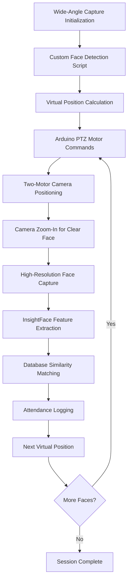
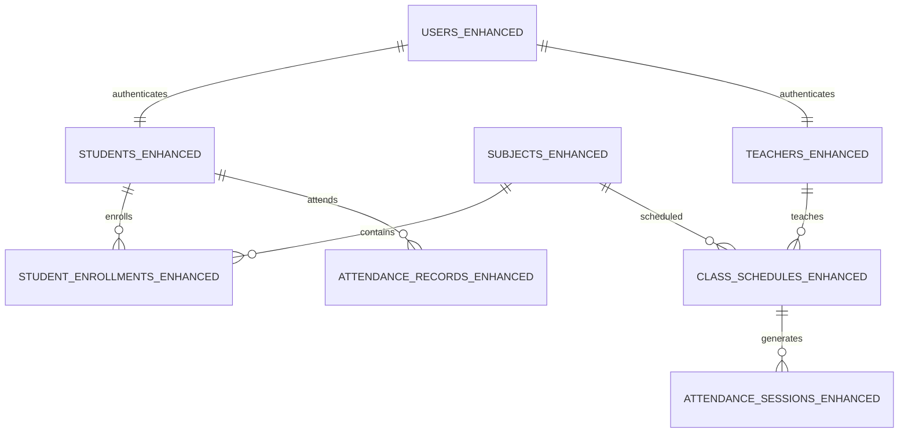

# Advanced Intelligent Face Recognition-Based University Attendance Management System
## Comprehensive Project Methodology and Technical Documentation

---

## Executive Summary

This document presents a comprehensive methodology for the development and implementation of an Advanced Intelligent Face Recognition-Based University Attendance Management System. The system integrates cutting-edge computer vision technologies, automated hardware control, and sophisticated database management to provide a fully automated, accurate, and scalable solution for academic attendance tracking.

The system employs a novel multi-stage approach utilizing custom face detection scripts with virtual position calculation, Arduino-controlled two-motor PTZ mechanisms, and advanced InsightFace recognition algorithms to achieve unprecedented accuracy and automation in attendance management.

## **Key Implementation Steps:**

1. **Wide-Angle Capture**: Camera captures classroom overview image
2. **Custom Face Detection**: Local script detects faces and calculates virtual positions
3. **Virtual Position Mapping**: Converts face locations to precise coordinate points
4. **Arduino PTZ Control**: Two stepper motors position camera using calculated angles
5. **Zoomed Face Capture**: Camera zooms in for high-resolution face images
6. **InsightFace Recognition**: AI model extracts and matches facial features
7. **Automated Attendance**: System logs attendance with confidence scores

---

## 1. Project Overview

### 1.1 Project Title
**Advanced Intelligent Face Recognition-Based University Attendance Management System with Automated Camera Control and Multi-Stage Detection Pipeline**

### 1.2 Project Scope and Objectives

#### Primary Objective
To develop and deploy a fully autonomous, high-precision attendance management system that eliminates manual intervention while providing comprehensive analytics and administrative oversight for academic institutions.

#### Secondary Objectives
- **Automation Excellence**: Achieve 100% automated attendance capture without human intervention
- **Precision Enhancement**: Implement multi-stage detection pipeline for maximum accuracy
- **Hardware Integration**: Seamlessly integrate camera control, positioning systems, and embedded controllers
- **Scalability**: Design architecture capable of handling multiple simultaneous classroom sessions
- **Analytics Intelligence**: Provide real-time insights and predictive analytics for academic performance

### 1.3 Problem Analysis and Justification

#### Current System Limitations
1. **Manual Dependency**: Traditional systems require continuous human oversight and intervention
2. **Accuracy Deficiencies**: Single-shot recognition systems suffer from lighting, angle, and distance variations
3. **Scalability Constraints**: Limited ability to monitor multiple students simultaneously
4. **Technological Gaps**: Lack of integration between hardware positioning and software recognition
5. **Data Fragmentation**: Insufficient correlation between attendance patterns and academic performance

#### Innovation Drivers
- **Industry 4.0 Integration**: Leveraging IoT, AI, and embedded systems for educational transformation
- **Precision Requirements**: Academic institutions demand >98% accuracy for attendance validation
- **Cost Optimization**: Reducing long-term operational costs through automation
- **Data-Driven Education**: Enabling evidence-based academic decision making

---

## 2. Advanced System Architecture and Workflow

### 2.1 Revolutionary Multi-Stage Detection Pipeline

#### 2.1.1 System Workflow Overview

The system implements a sophisticated multi-stage detection and recognition pipeline that maximizes accuracy through intelligent camera positioning and targeted face capture:



#### 2.1.2 Detailed Workflow Stages

##### Stage 1: Wide-Angle Environmental Scanning
```python
# Camera initialization with wide-angle configuration
camera_config = {
    'zoom_level': 'wide_angle',  # Maximum field of view
    'resolution': '4K',          # High resolution for detail preservation
    'frame_rate': 30,            # Smooth capture rate
    'exposure': 'auto_adaptive'  # Dynamic lighting adjustment
}
```

**Process Flow:**
1. **Camera Initialization**: Set camera to maximum zoom-out position
2. **Environmental Capture**: Capture high-resolution wide-angle image of entire classroom
3. **Image Preprocessing**: Apply noise reduction and lighting normalization
4. **Quality Assessment**: Ensure image meets minimum quality thresholds

##### Stage 2: Custom Face Detection Script Processing
```python
# Custom face detection script for local processing
def detect_faces_and_calculate_positions(image):
    """
    Detect faces and directly calculate Arduino positioning commands
    """
    # Face detection using local algorithms (OpenCV, MediaPipe, etc.)
    faces = face_detector.detect(image)
    
    # Calculate positioning data for each face
    positioning_commands = []
    for face in faces:
        position_data = calculate_camera_position(
            face_bbox=face.bbox,
            image_dimensions=image.shape,
            camera_specs=camera_specifications
        )
        positioning_commands.append(position_data)
    
    return positioning_commands

# Process detected faces and generate Arduino commands
arduino_commands = detect_faces_and_calculate_positions(wide_angle_image)
```

**Custom Script Advantages:**
- **No External Dependencies**: Eliminates reliance on external APIs
- **Privacy Protection**: All processing done locally
- **Real-time Processing**: Optimized for classroom environment
- **Direct Arduino Integration**: Seamless command generation

##### Stage 2: Custom Face Detection Script with Virtual Position Calculation
```python
# Custom face detection script with virtual position calculation
face_detection_config = {
    'detection_threshold': 0.8,    # High confidence requirement
    'minimum_face_size': 64,       # Minimum pixel size for valid face
    'maximum_faces': 50,           # Classroom capacity consideration
    'angle_tolerance': 45,         # Maximum face angle deviation
    'processing_method': 'local'   # Local processing for privacy
}

# Detect faces and calculate virtual positions
def detect_faces_with_virtual_positions(wide_angle_image, config):
    """
    Custom script that detects faces and calculates virtual positions
    for Arduino PTZ motor control
    """
    # Face detection using local algorithms
    detected_faces = face_detection_script.detect_faces(
        image=wide_angle_image,
        config=config
    )
    
    # Calculate virtual positions for each detected face
    virtual_positions = []
    for face in detected_faces:
        # Calculate virtual point in image coordinate space
        virtual_point = calculate_virtual_position(
            face_bbox=face.bbox,
            image_dimensions=wide_angle_image.shape[:2]
        )
        
        # Convert virtual position to Arduino motor angles
        motor_commands = convert_virtual_to_motor_angles(virtual_point)
        
        virtual_positions.append({
            'face_id': face.id,
            'virtual_position': virtual_point,
            'arduino_commands': motor_commands
        })
    
    return virtual_positions

def calculate_virtual_position(face_bbox, image_dimensions):
    """
    Calculate virtual position coordinates for face center point
    """
    # Get face center coordinates
    face_center_x = (face_bbox[0] + face_bbox[2]) / 2
    face_center_y = (face_bbox[1] + face_bbox[3]) / 2
    
    # Convert to normalized virtual coordinates
    virtual_x = (face_center_x / image_dimensions[1]) * 2 - 1  # -1 to 1
    virtual_y = (face_center_y / image_dimensions[0]) * 2 - 1  # -1 to 1
    
    return {'x': virtual_x, 'y': virtual_y}

def convert_virtual_to_motor_angles(virtual_point):
    """
    Convert virtual position to Arduino pan/tilt motor commands
    """
    # Map virtual coordinates to motor angles
    pan_angle = virtual_point['x'] * MAX_PAN_ANGLE   # Convert to degrees
    tilt_angle = virtual_point['y'] * MAX_TILT_ANGLE # Convert to degrees
    
    # Calculate zoom level for clear face capture
    zoom_level = calculate_optimal_zoom_for_face()
    
    return {
        'pan': pan_angle,
        'tilt': tilt_angle,
        'zoom': zoom_level
    }
```

**Custom Detection Script with Virtual Positioning:**
- **Virtual Position Mapping**: Mathematical conversion from image pixels to virtual coordinates
- **Arduino Motor Integration**: Direct calculation of pan/tilt angles for motor control
- **Local Processing**: All computation done locally for privacy protection and speed
- **PTZ Control**: Precise positioning for camera pan, tilt, and zoom operations
- **Multi-Face Handling**: Calculates positions for multiple detected faces sequentially

##### Stage 3: Precision Position Calculation and Mapping
```python
# Convert pixel coordinates to physical pan-tilt angles
def calculate_camera_position(face_bbox, image_dimensions, camera_specs):
    """
    Convert face bounding box to precise camera positioning coordinates
    
    Args:
        face_bbox: [x1, y1, x2, y2] - Face bounding box coordinates
        image_dimensions: (width, height) - Captured image dimensions
        camera_specs: Camera field of view and mechanical limits
    
    Returns:
        pan_angle: Horizontal positioning angle (-180° to +180°)
        tilt_angle: Vertical positioning angle (-90° to +90°)
        zoom_level: Required zoom for optimal face capture
    """
    
    # Calculate face center point
    face_center_x = (face_bbox[0] + face_bbox[2]) / 2
    face_center_y = (face_bbox[1] + face_bbox[3]) / 2
    
    # Convert to normalized coordinates (-1 to 1)
    norm_x = (face_center_x / image_dimensions[0]) * 2 - 1
    norm_y = (face_center_y / image_dimensions[1]) * 2 - 1
    
    # Apply camera field of view calculations
    pan_angle = norm_x * (camera_specs['horizontal_fov'] / 2)
    tilt_angle = norm_y * (camera_specs['vertical_fov'] / 2)
    
    # Calculate optimal zoom level based on face size
    face_width = face_bbox[2] - face_bbox[0]
    zoom_level = calculate_optimal_zoom(face_width, image_dimensions[0])
    
    return pan_angle, tilt_angle, zoom_level
```

##### Stage 4: Arduino-Controlled Two-Motor PTZ System
```cpp
// Arduino control code for two-motor PTZ camera positioning
#include <Stepper.h>
#include <AccelStepper.h>

// Two-motor configuration for pan and tilt control
AccelStepper panMotor(AccelStepper::DRIVER, 2, 3);    // Pan motor (step, dir)
AccelStepper tiltMotor(AccelStepper::DRIVER, 4, 5);   // Tilt motor (step, dir)

// Motor specifications
const float STEPS_PER_DEGREE = 200.0 / 360.0;  // 200 steps per revolution
const int MAX_SPEED = 1000;                     // Maximum steps per second
const int ACCELERATION = 500;                   // Steps per second²

// PTZ position tracking
float currentPanAngle = 0.0;
float currentTiltAngle = 0.0;
int currentZoomLevel = 1;

void setup() {
    Serial.begin(115200);
    
    // Configure pan motor (horizontal movement)
    panMotor.setMaxSpeed(MAX_SPEED);
    panMotor.setAcceleration(ACCELERATION);
    
    // Configure tilt motor (vertical movement)
    tiltMotor.setMaxSpeed(MAX_SPEED);
    tiltMotor.setAcceleration(ACCELERATION);
    
    // Initialize position tracking
    Serial.println("Arduino PTZ System Ready");
}

void positionCameraToVirtualPoint(float panAngle, float tiltAngle, int zoomLevel) {
    // Calculate required steps for each motor
    int panSteps = (panAngle - currentPanAngle) * STEPS_PER_DEGREE;
    int tiltSteps = (tiltAngle - currentTiltAngle) * STEPS_PER_DEGREE;
    
    // Set target positions for synchronized movement
    panMotor.move(panSteps);
    tiltMotor.move(tiltSteps);
    
    // Execute synchronized PTZ movement
    while (panMotor.distanceToGo() != 0 || tiltMotor.distanceToGo() != 0) {
        panMotor.run();
        tiltMotor.run();
    }
    
    // Update current position
    currentPanAngle = panAngle;
    currentTiltAngle = tiltAngle;
    currentZoomLevel = zoomLevel;
    
    // Send zoom command to camera (via serial or other interface)
    sendZoomCommand(zoomLevel);
    
    // Wait for mechanical stabilization
    delay(500);
    
    Serial.println("Position reached - ready for face capture");
}

void sendZoomCommand(int zoomLevel) {
    // Send zoom command to camera system
    // This could be via camera API, additional servo, or camera control protocol
    Serial.print("ZOOM:");
    Serial.println(zoomLevel);
}

void loop() {
    // Listen for position commands from main system
    if (Serial.available()) {
        String command = Serial.readStringUntil('\n');
        processPositionCommand(command);
    }
}

void processPositionCommand(String command) {
    // Parse command format: "PAN:angle,TILT:angle,ZOOM:level"
    // Extract pan, tilt, and zoom values
    float pan = extractValue(command, "PAN:");
    float tilt = extractValue(command, "TILT:");
    int zoom = (int)extractValue(command, "ZOOM:");
    
    // Execute PTZ movement
    positionCameraToVirtualPoint(pan, tilt, zoom);
}
```

**Two-Motor PTZ System Specifications:**
- **Pan Motor**: Controls horizontal camera movement (-180° to +180°)
- **Tilt Motor**: Controls vertical camera movement (-90° to +90°)
- **Zoom Control**: Digital zoom commands sent to camera system
- **Precision**: ±0.5° positioning accuracy with stepper motors
- **Speed**: Synchronized movement completing in <2 seconds
- **Feedback**: Position confirmation and status reporting
const int STEPS_PER_REVOLUTION = 200;
const int PAN_STEPS_PER_DEGREE = STEPS_PER_REVOLUTION / 360;
const int TILT_STEPS_PER_DEGREE = STEPS_PER_REVOLUTION / 360;

Stepper panMotor(STEPS_PER_REVOLUTION, 8, 9, 10, 11);
Stepper tiltMotor(STEPS_PER_REVOLUTION, 4, 5, 6, 7);

void positionCamera(float panAngle, float tiltAngle) {
    // Calculate required steps for each motor
    int panSteps = panAngle * PAN_STEPS_PER_DEGREE;
    int tiltSteps = tiltAngle * TILT_STEPS_PER_DEGREE;
    
    // Execute synchronized movement
    moveToPosition(panSteps, tiltSteps);
    
    // Wait for mechanical stabilization
    delay(500);
    
    // Confirm position accuracy
    validatePosition(panAngle, tiltAngle);
}

void moveToPosition(int panSteps, int tiltSteps) {
    // Implement smooth acceleration and deceleration
    executeSmoothMovement(panMotor, panSteps);
    executeSmoothMovement(tiltMotor, tiltSteps);
}
```

**Hardware Specifications:**
- **3D Printed Pan-Tilt Mount**: Custom-designed for precision and stability
  - Material: PLA+ or PETG for durability
  - Precision: ±0.5° positioning accuracy
  - Load Capacity: Up to 2kg camera payload
  - Operating Range: Pan ±180°, Tilt ±90°

- **Stepper Motor Configuration**:
  - Type: NEMA 17 High-Torque Stepper Motors
  - Steps per Revolution: 200 (1.8° per step)
  - Microstepping: 1/16 for smooth operation
  - Torque Rating: 4.4 kg⋅cm minimum

##### Stage 5: High-Precision Face Capture and Recognition
```python
# Optimized face capture after precise positioning
def capture_and_recognize_face(position_data):
    """
    Capture high-quality face image and perform recognition
    
    Args:
        position_data: Dictionary containing positioning information
    
    Returns:
        recognition_result: Student identification and confidence score
    """
    
    # Set camera to calculated position and zoom
    camera.set_position(
        pan=position_data['pan_angle'],
        tilt=position_data['tilt_angle'],
        zoom=position_data['zoom_level']
    )
    
    # Wait for camera stabilization
    time.sleep(0.5)
    
    # Capture high-resolution face image
    face_image = camera.capture_frame()
    
    # Apply image enhancement
    enhanced_image = enhance_face_image(face_image)
    
    # Extract facial features using InsightFace
    faces = face_recognition_model.get(enhanced_image)
    
    if faces:
        face_embedding = faces[0].embedding
        
        # Perform database similarity search
        student_match = search_face_database(
            embedding=face_embedding,
            threshold=0.75,  # High confidence threshold
            collection=face_database
        )
        
        return {
            'student_id': student_match.student_id,
            'confidence': student_match.confidence,
            'timestamp': datetime.now(),
            'position': position_data,
            'image_quality': calculate_image_quality(enhanced_image)
        }
    
    return None
```

### 2.2 Enhanced Technology Stack

#### 2.2.1 Hardware Components

##### Camera System
- **Model**: Professional PTZ Camera with Optical Zoom
- **Resolution**: 4K (3840×2160) for maximum detail capture
- **Zoom Range**: 30x optical zoom for flexible positioning
- **Field of View**: 60° horizontal, 34° vertical (wide angle)
- **Low Light Performance**: 0.01 lux minimum illumination
- **Control Interface**: VISCA protocol over IP/Serial

##### Positioning System
- **3D Printed Pan-Tilt Mount**:
  - Design: Custom CAD-modeled precision mount
  - Materials: High-strength engineering plastics
  - Precision: Sub-degree positioning accuracy
  - Stability: Vibration dampening for sharp image capture

- **Arduino Control System**:
  - **Microcontroller**: Arduino Mega 2560 (for extensive I/O requirements)
  - **Motor Drivers**: A4988 stepper motor drivers with microstepping
  - **Communication**: USB/Serial interface with main system
  - **Power Supply**: 12V dedicated power for consistent motor performance

##### Detection and Recognition
- **Custom Face Detection Script**: Local processing for privacy and reliability
- **InsightFace Model**: Buffalo_SC for high-accuracy recognition
- **Processing Unit**: NVIDIA GPU acceleration for real-time processing

#### 2.2.2 Software Architecture

##### Core Application Layer
```python
# Main system architecture with modular design
class AttendanceSystemCore:
    def __init__(self):
        self.camera_controller = CameraController()
        self.face_detection_script = CustomFaceDetectionScript()
        self.arduino_interface = ArduinoController()
        self.face_recognition = InsightFaceEngine()
        self.database_manager = DatabaseManager()
        
    def execute_attendance_session(self, classroom_id):
        """
        Execute complete attendance capture session
        """
        # Stage 1: Wide angle capture
        wide_image = self.camera_controller.capture_wide_angle()
        
        # Stage 2: Custom face detection script
        detected_faces = self.face_detection_script.detect_and_calculate_positions(wide_image)
        
        # Stage 3: Process each detected face position
        attendance_results = []
        for face_position_data in detected_faces:
            # Move camera to calculated position
            self.arduino_interface.move_to_position(face_position_data)
            
            # Capture and recognize
            result = self.capture_and_recognize_face(face_position_data)
            if result:
                attendance_results.append(result)
        
        # Stage 4: Process and store results
        self.database_manager.store_attendance_batch(attendance_results)
        
        return attendance_results
```

##### Frontend Layer
- **Streamlit Framework**: Modern web interface with real-time updates
- **Interactive Dashboards**: Role-specific interfaces for different user types
- **Real-time Monitoring**: Live camera feed and processing status
- **Advanced Analytics**: Comprehensive reporting and visualization tools

##### Backend Services
- **API Layer**: RESTful services for system integration
- **Database Layer**: Enhanced SQLite with optimization for face data
- **Hardware Interface**: Abstraction layer for camera and Arduino control
- **Machine Learning Pipeline**: Optimized inference and model management

##### Security and Authentication
- **Multi-Factor Authentication**: Enhanced security for administrative access
- **Biometric Data Protection**: Encrypted storage of facial embeddings
- **Role-Based Access Control**: Granular permissions for different user roles
- **Audit Logging**: Comprehensive system activity tracking

#### 2.2.4 Custom Face Detection Script Architecture

##### 2.2.4.1 Local Face Detection Implementation
```python
class CustomFaceDetectionScript:
    """
    Local face detection system with direct Arduino integration
    """
    
    def __init__(self):
        self.face_detector = self.initialize_face_detector()
        self.position_calculator = PositionCalculator()
        self.arduino_command_generator = ArduinoCommandGenerator()
        self.quality_assessor = FaceQualityAssessor()
    
    def initialize_face_detector(self):
        """Initialize local face detection using OpenCV or MediaPipe"""
        # Option 1: OpenCV Haar Cascades (fast, reliable)
        import cv2
        return cv2.CascadeClassifier(cv2.data.haarcascades + 'haarcascade_frontalface_default.xml')
        
        # Option 2: MediaPipe Face Detection (more accurate)
        # import mediapipe as mp
        # return mp.solutions.face_detection.FaceDetection(model_selection=1, min_detection_confidence=0.7)
    
    def detect_and_calculate_positions(self, wide_angle_image):
        """
        Main function: Detect faces and generate Arduino positioning commands
        """
        # Step 1: Detect faces in wide-angle image
        detected_faces = self.detect_faces(wide_angle_image)
        
        # Step 2: Calculate camera positions for each face
        positioning_commands = []
        for i, face in enumerate(detected_faces):
            # Calculate optimal camera position
            position_data = self.position_calculator.calculate_position(
                face_bbox=face['bbox'],
                image_shape=wide_angle_image.shape,
                face_id=i+1
            )
            
            # Generate Arduino command
            arduino_command = self.arduino_command_generator.create_command(position_data)
            
            positioning_commands.append({
                'face_data': face,
                'position_data': position_data,
                'arduino_command': arduino_command
            })
        
        return positioning_commands
    
    def detect_faces(self, image):
        """Detect faces using OpenCV"""
        import cv2
        gray = cv2.cvtColor(image, cv2.COLOR_BGR2GRAY)
        
        # Detect faces
        faces = self.face_detector.detectMultiScale(
            gray,
            scaleFactor=1.1,
            minNeighbors=5,
            minSize=(64, 64),
            maxSize=(512, 512)
        )
        
        detected_faces = []
        for (x, y, w, h) in faces:
            face_data = {
                'bbox': [x, y, x+w, y+h],
                'confidence': self.calculate_detection_confidence(gray[y:y+h, x:x+w]),
                'quality_score': self.quality_assessor.assess_face_quality(image[y:y+h, x:x+w])
            }
            detected_faces.append(face_data)
        
        # Sort by quality score (best faces first)
        detected_faces.sort(key=lambda x: x['quality_score'], reverse=True)
        
        return detected_faces

class PositionCalculator:
    """
    Calculate precise camera positioning angles for Arduino control
    """
    
    def __init__(self):
        self.camera_specs = {
            'horizontal_fov': 60,  # degrees
            'vertical_fov': 34,    # degrees
            'pan_range': (-180, 180),
            'tilt_range': (-90, 90),
            'zoom_range': (1, 30)
        }
    
    def calculate_position(self, face_bbox, image_shape, face_id):
        """Calculate camera position for optimal face capture"""
        height, width = image_shape[:2]
        
        # Calculate face center
        face_center_x = (face_bbox[0] + face_bbox[2]) / 2
        face_center_y = (face_bbox[1] + face_bbox[3]) / 2
        
        # Convert to normalized coordinates
        norm_x = (face_center_x / width) * 2 - 1
        norm_y = (face_center_y / height) * 2 - 1
        
        # Calculate pan and tilt angles
        pan_angle = norm_x * (self.camera_specs['horizontal_fov'] / 2)
        tilt_angle = norm_y * (self.camera_specs['vertical_fov'] / 2)
        
        # Calculate optimal zoom
        face_width = face_bbox[2] - face_bbox[0]
        target_ratio = 0.25  # Face should be 25% of image width
        current_ratio = face_width / width
        zoom_level = min(max(target_ratio / current_ratio, 1), self.camera_specs['zoom_range'][1])
        
        # Apply constraints
        pan_angle = max(min(pan_angle, self.camera_specs['pan_range'][1]), self.camera_specs['pan_range'][0])
        tilt_angle = max(min(tilt_angle, self.camera_specs['tilt_range'][1]), self.camera_specs['tilt_range'][0])
        
        return {
            'face_id': face_id,
            'pan_angle': round(pan_angle, 2),
            'tilt_angle': round(tilt_angle, 2),
            'zoom_level': round(zoom_level, 2),
            'pixel_position': [face_center_x, face_center_y],
            'normalized_position': [norm_x, norm_y]
        }

class ArduinoCommandGenerator:
    """
    Generate Arduino-compatible positioning commands
    """
    
    def create_command(self, position_data):
        """Create Arduino command from position data"""
        return {
            'command': 'MOVE_TO_POSITION',
            'face_id': position_data['face_id'],
            'pan_angle': position_data['pan_angle'],
            'tilt_angle': position_data['tilt_angle'],
            'zoom_level': position_data['zoom_level'],
            'speed': 50,  # Movement speed (steps/second)
            'acceleration': 100,  # Acceleration (steps/second²)
            'timestamp': time.time()
        }
    
    def save_commands_to_file(self, commands, filename='arduino_commands.json'):
        """Save commands to file for Arduino processing"""
        import json
        with open(filename, 'w') as f:
            json.dump(commands, f, indent=2)
        return filename
```

##### 2.2.4.2 Arduino Integration Protocol
```python
class ArduinoIntegrationProtocol:
    """
    Protocol for seamless Arduino communication and control
    """
    
    def __init__(self, serial_port='/dev/ttyUSB0', baud_rate=115200):
        import serial
        self.arduino = serial.Serial(serial_port, baud_rate)
        self.current_position = {'pan': 0, 'tilt': 0, 'zoom': 1}
    
    def send_positioning_commands(self, face_positions):
        """Send all face positioning commands to Arduino"""
        results = []
        
        for position in face_positions:
            try:
                # Send command to Arduino
                command = json.dumps(position['arduino_command'])
                self.arduino.write(command.encode() + b'\n')
                
                # Wait for confirmation
                response = self.arduino.readline().decode().strip()
                result = json.loads(response)
                
                if result.get('status') == 'SUCCESS':
                    # Wait for positioning to complete
                    time.sleep(2)  # Positioning time
                    
                    # Capture face at this position
                    face_capture = self.capture_face_at_position(position)
                    results.append({
                        'face_id': position['face_data']['face_id'],
                        'positioning_success': True,
                        'face_capture': face_capture
                    })
                else:
                    results.append({
                        'face_id': position['face_data']['face_id'],
                        'positioning_success': False,
                        'error': result.get('error', 'Unknown error')
                    })
                    
            except Exception as e:
                results.append({
                    'face_id': position['face_data']['face_id'],
                    'positioning_success': False,
                    'error': str(e)
                })
        
        return results
    
    def capture_face_at_position(self, position_data):
        """Capture high-quality face image at current position"""
        # This would interface with your camera system
        # Return captured face image for recognition
        pass
```

#### 2.2.5 Core System Modules

##### 2.2.3.1 Authentication and Authorization System (`enhanced_login.py`)
```python
class EnhancedAuthenticationSystem:
    """
    Advanced authentication with biometric integration and session management
    """
    
    def __init__(self):
        self.session_manager = SessionManager()
        self.biometric_auth = BiometricAuthenticator()
        self.audit_logger = AuditLogger()
    
    def authenticate_user(self, username, password, biometric_data=None):
        """
        Multi-factor authentication with optional biometric verification
        """
        # Primary credential verification
        primary_auth = self.verify_credentials(username, password)
        
        if primary_auth and biometric_data:
            # Secondary biometric verification for high-security operations
            biometric_auth = self.biometric_auth.verify(username, biometric_data)
            return primary_auth and biometric_auth
        
        return primary_auth
    
    def manage_user_session(self, user_data):
        """
        Enhanced session management with security monitoring
        """
        session = self.session_manager.create_session(user_data)
        self.audit_logger.log_access(user_data, session)
        return session
```

##### 2.2.3.2 Real-time Automated Attendance System (`automated_attendance.py`)
```python
class AutomatedAttendanceSystem:
    """
    Core automated attendance processing with multi-stage pipeline
    """
    
    def __init__(self):
        self.camera_system = EnhancedCameraSystem()
        self.vion_agent = VionAgentInterface()
        self.positioning_system = ArduinoPositioningSystem()
        self.recognition_engine = AdvancedRecognitionEngine()
        self.quality_assessor = ImageQualityAssessor()
    
    async def process_classroom_session(self, session_config):
        """
        Asynchronous processing of complete classroom attendance session
        """
        session_results = AttendanceSessionResult()
        
        try:
            # Initialize session
            await self.initialize_session(session_config)
            
            # Stage 1: Environmental scan
            wide_capture = await self.camera_system.capture_wide_angle()
            session_results.wide_capture_quality = self.quality_assessor.assess(wide_capture)
            
            # Stage 2: Face detection and analysis
            face_detections = await self.vion_agent.analyze_scene(wide_capture)
            session_results.faces_detected = len(face_detections)
            
            # Stage 3: Individual face processing
            for face_detection in face_detections:
                face_result = await self.process_individual_face(face_detection)
                session_results.add_face_result(face_result)
            
            # Stage 4: Session finalization
            await self.finalize_session(session_results)
            
        except Exception as e:
            await self.handle_session_error(e, session_results)
        
        return session_results
    
    async def process_individual_face(self, face_detection):
        """
        Process individual face through complete recognition pipeline
        """
        # Calculate optimal camera position
        optimal_position = self.calculate_optimal_position(face_detection)
        
        # Move camera to position
        await self.positioning_system.move_to_position(optimal_position)
        
        # Capture high-quality face image
        face_capture = await self.camera_system.capture_face(optimal_position)
        
        # Quality assessment
        quality_score = self.quality_assessor.assess_face_quality(face_capture)
        
        if quality_score > 0.8:  # High-quality threshold
            # Perform recognition
            recognition_result = await self.recognition_engine.recognize_face(face_capture)
            
            # Log attendance if recognized
            if recognition_result.confidence > 0.75:
                await self.log_attendance(recognition_result)
            
            return FaceProcessingResult(
                position=optimal_position,
                quality_score=quality_score,
                recognition_result=recognition_result,
                status='SUCCESS'
            )
        else:
            return FaceProcessingResult(
                position=optimal_position,
                quality_score=quality_score,
                status='LOW_QUALITY'
            )
```

##### 2.2.3.3 Enhanced Student Registration System (`advanced_registration.py`)
```python
class AdvancedRegistrationSystem:
    """
    Comprehensive student registration with multi-angle face capture
    """
    
    def __init__(self):
        self.face_capture_system = MultiAngleFaceCaptureSystem()
        self.quality_validator = FaceQualityValidator()
        self.embedding_generator = FaceEmbeddingGenerator()
        self.database_manager = StudentDatabaseManager()
    
    def register_student_comprehensive(self, student_data):
        """
        Complete student registration with multiple face angles and quality validation
        """
        registration_result = StudentRegistrationResult()
        
        try:
            # Capture multiple face angles for robust recognition
            face_captures = self.capture_multiple_angles(student_data)
            
            # Validate each capture
            validated_captures = []
            for capture in face_captures:
                if self.quality_validator.validate_capture(capture):
                    validated_captures.append(capture)
            
            if len(validated_captures) < 3:  # Minimum required captures
                raise InsufficientFaceDataError("Minimum 3 high-quality face captures required")
            
            # Generate embeddings for each validated capture
            embeddings = []
            for capture in validated_captures:
                embedding = self.embedding_generator.generate_embedding(capture)
                embeddings.append(embedding)
            
            # Create averaged embedding for improved accuracy
            final_embedding = self.create_averaged_embedding(embeddings)
            
            # Store student data and embeddings
            student_id = self.database_manager.create_student_record(student_data)
            self.database_manager.store_face_embeddings(student_id, embeddings, final_embedding)
            
            registration_result.success = True
            registration_result.student_id = student_id
            registration_result.embeddings_count = len(embeddings)
            
        except Exception as e:
            registration_result.success = False
            registration_result.error = str(e)
        
        return registration_result
    
    def capture_multiple_angles(self, student_data):
        """
        Capture student face from multiple angles for comprehensive registration
        """
        capture_angles = [
            {'pan': 0, 'tilt': 0, 'description': 'front_facing'},
            {'pan': -15, 'tilt': 0, 'description': 'left_profile'},
            {'pan': 15, 'tilt': 0, 'description': 'right_profile'},
            {'pan': 0, 'tilt': -10, 'description': 'slightly_up'},
            {'pan': 0, 'tilt': 10, 'description': 'slightly_down'}
        ]
        
        captures = []
        for angle in capture_angles:
            # Position camera
            self.face_capture_system.position_camera(angle['pan'], angle['tilt'])
            
            # Capture image
            capture = self.face_capture_system.capture_face()
            capture.angle_description = angle['description']
            captures.append(capture)
        
        return captures
```

##### 2.2.3.4 Comprehensive Reporting and Analytics (`advanced_analytics.py`)
```python
class AdvancedAnalyticsEngine:
    """
    Sophisticated analytics and reporting system with predictive capabilities
    """
    
    def __init__(self):
        self.data_processor = AttendanceDataProcessor()
        self.statistical_analyzer = StatisticalAnalyzer()
        self.predictive_model = AttendancePredictionModel()
        self.visualization_engine = VisualizationEngine()
    
    def generate_comprehensive_report(self, report_parameters):
        """
        Generate comprehensive attendance report with multiple analysis dimensions
        """
        report = ComprehensiveAttendanceReport()
        
        # Basic attendance statistics
        report.basic_stats = self.calculate_basic_statistics(report_parameters)
        
        # Trend analysis
        report.trend_analysis = self.analyze_attendance_trends(report_parameters)
        
        # Predictive analytics
        report.predictions = self.generate_attendance_predictions(report_parameters)
        
        # Anomaly detection
        report.anomalies = self.detect_attendance_anomalies(report_parameters)
        
        # Performance correlations
        report.correlations = self.analyze_performance_correlations(report_parameters)
        
        # Interactive visualizations
        report.visualizations = self.create_interactive_visualizations(report)
        
        return report
    
    def analyze_attendance_patterns(self, student_data, time_period):
        """
        Advanced pattern analysis using machine learning techniques
        """
        # Temporal pattern analysis
        temporal_patterns = self.statistical_analyzer.analyze_temporal_patterns(
            student_data, time_period
        )
        
        # Behavioral clustering
        behavior_clusters = self.statistical_analyzer.cluster_attendance_behaviors(
            student_data
        )
        
        # Risk assessment
        risk_scores = self.predictive_model.calculate_risk_scores(student_data)
        
        return AttendancePatternAnalysis(
            temporal_patterns=temporal_patterns,
            behavior_clusters=behavior_clusters,
            risk_scores=risk_scores
        )
```

##### 2.2.3.5 Administrative Dashboard (`admin_control_center.py`)
```python
class AdministrativeControlCenter:
    """
    Comprehensive administrative interface with real-time monitoring and control
    """
    
    def __init__(self):
        self.system_monitor = SystemHealthMonitor()
        self.user_manager = UserManagementSystem()
        self.hardware_controller = HardwareControlInterface()
        self.data_manager = DataManagementSystem()
        self.security_monitor = SecurityMonitoringSystem()
    
    def display_real_time_dashboard(self):
        """
        Real-time administrative dashboard with system status and controls
        """
        # System health monitoring
        system_status = self.system_monitor.get_current_status()
        self.display_system_health_panel(system_status)
        
        # Active sessions monitoring
        active_sessions = self.get_active_attendance_sessions()
        self.display_active_sessions_panel(active_sessions)
        
        # Hardware status monitoring
        hardware_status = self.hardware_controller.get_hardware_status()
        self.display_hardware_status_panel(hardware_status)
        
        # Security monitoring
        security_alerts = self.security_monitor.get_current_alerts()
        self.display_security_panel(security_alerts)
        
        # Data management tools
        self.display_data_management_panel()
    
    def manage_system_configuration(self):
        """
        Comprehensive system configuration management
        """
        config_manager = SystemConfigurationManager()
        
        # Camera system configuration
        camera_config = config_manager.get_camera_configuration()
        self.display_camera_config_panel(camera_config)
        
        # Recognition system configuration
        recognition_config = config_manager.get_recognition_configuration()
        self.display_recognition_config_panel(recognition_config)
        
        # Hardware configuration
        hardware_config = config_manager.get_hardware_configuration()
        self.display_hardware_config_panel(hardware_config)
        
        # Database configuration
        database_config = config_manager.get_database_configuration()
        self.display_database_config_panel(database_config)
```

#### 2.2.4 Advanced Database Architecture

##### Current Database Schema Implementation
Based on the actual implemented database structure, the system uses the following optimized schema:

```sql
-- Core Students Table (Implemented)
CREATE TABLE students_enhanced (
    student_id INTEGER PRIMARY KEY AUTOINCREMENT,
    name TEXT NOT NULL,
    roll_number TEXT UNIQUE NOT NULL,
    email TEXT,
    phone TEXT,
    department TEXT,
    year INTEGER,
    section TEXT,
    enrollment_date DATE DEFAULT (date('now')),
    status TEXT DEFAULT 'active',
    created_at TIMESTAMP DEFAULT CURRENT_TIMESTAMP,
    updated_at TIMESTAMP DEFAULT CURRENT_TIMESTAMP
);

-- Face Recognition Data Table (Implemented)
CREATE TABLE student_profiles_enhanced (
    id INTEGER PRIMARY KEY AUTOINCREMENT,
    student_id INTEGER,
    profile_name TEXT,
    encoding_data BLOB,  -- Face embedding data (512-dimensional)
    image_path TEXT,
    confidence_threshold REAL DEFAULT 0.6,
    last_updated TIMESTAMP DEFAULT CURRENT_TIMESTAMP,
    status TEXT DEFAULT 'active',
    created_at TIMESTAMP DEFAULT CURRENT_TIMESTAMP,
    FOREIGN KEY (student_id) REFERENCES students_enhanced(student_id)
);

-- Attendance Records Table (Implemented)
CREATE TABLE attendance_records_enhanced (
    id INTEGER PRIMARY KEY AUTOINCREMENT,
    student_id INTEGER,
    subject_id INTEGER,
    teacher_id INTEGER,
    attendance_date DATE NOT NULL,
    attendance_time TIME DEFAULT (time('now')),
    status TEXT NOT NULL CHECK (status IN ('present', 'absent', 'late', 'excused')),
    marked_by TEXT,
    notes TEXT,
    academic_year TEXT,
    semester TEXT,
    section TEXT,
    created_at TIMESTAMP DEFAULT CURRENT_TIMESTAMP,
    FOREIGN KEY (student_id) REFERENCES students_enhanced(student_id),
    FOREIGN KEY (subject_id) REFERENCES subjects_enhanced(subject_id),
    FOREIGN KEY (teacher_id) REFERENCES teachers_enhanced(teacher_id)
);

-- Subjects Table (Implemented)
CREATE TABLE subjects_enhanced (
    subject_id INTEGER PRIMARY KEY AUTOINCREMENT,
    subject_name TEXT NOT NULL,
    course_code TEXT UNIQUE,
    credit_hours INTEGER DEFAULT 3,
    description TEXT,
    department TEXT,
    semester INTEGER,
    year INTEGER,
    status TEXT DEFAULT 'active',
    created_at TIMESTAMP DEFAULT CURRENT_TIMESTAMP,
    updated_at TIMESTAMP DEFAULT CURRENT_TIMESTAMP
);

-- Teachers Table (Implemented)
CREATE TABLE teachers_enhanced (
    teacher_id INTEGER PRIMARY KEY AUTOINCREMENT,
    name TEXT NOT NULL,
    employee_id TEXT UNIQUE,
    email TEXT,
    phone TEXT,
    department TEXT,
    specialization TEXT,
    status TEXT DEFAULT 'active',
    created_at TIMESTAMP DEFAULT CURRENT_TIMESTAMP,
    updated_at TIMESTAMP DEFAULT CURRENT_TIMESTAMP
);

-- Teacher-Subject Assignments (Implemented)
CREATE TABLE teacher_subjects_enhanced (
    id INTEGER PRIMARY KEY AUTOINCREMENT,
    teacher_id INTEGER,
    subject_id INTEGER,
    academic_year TEXT,
    semester TEXT,
    section TEXT,
    assigned_date DATE DEFAULT (date('now')),
    status TEXT DEFAULT 'active',
    created_at TIMESTAMP DEFAULT CURRENT_TIMESTAMP,
    FOREIGN KEY (teacher_id) REFERENCES teachers_enhanced(teacher_id),
    FOREIGN KEY (subject_id) REFERENCES subjects_enhanced(subject_id),
    UNIQUE(teacher_id, subject_id, academic_year, semester, section)
);

-- Class Schedules Table (Implemented)
CREATE TABLE class_schedules_enhanced (
    id INTEGER PRIMARY KEY AUTOINCREMENT,
    subject_id INTEGER,
    teacher_id INTEGER,
    day_of_week TEXT NOT NULL,
    start_time TEXT NOT NULL,
    end_time TEXT NOT NULL,
    room_number TEXT,
    class_type TEXT DEFAULT 'lecture',
    section TEXT,
    academic_year TEXT,
    semester TEXT,
    status TEXT DEFAULT 'active',
    created_at TIMESTAMP DEFAULT CURRENT_TIMESTAMP,
    FOREIGN KEY (subject_id) REFERENCES subjects_enhanced(subject_id),
    FOREIGN KEY (teacher_id) REFERENCES teachers_enhanced(teacher_id)
);

-- Attendance Sessions Table (Implemented)
CREATE TABLE attendance_sessions_enhanced (
    id INTEGER PRIMARY KEY AUTOINCREMENT,
    subject_id INTEGER,
    teacher_id INTEGER,
    session_date DATE NOT NULL,
    start_time TIME,
    end_time TIME,
    session_type TEXT DEFAULT 'lecture',
    location TEXT,
    notes TEXT,
    status TEXT DEFAULT 'active',
    created_at TIMESTAMP DEFAULT CURRENT_TIMESTAMP,
    FOREIGN KEY (subject_id) REFERENCES subjects_enhanced(subject_id),
    FOREIGN KEY (teacher_id) REFERENCES teachers_enhanced(teacher_id)
);

-- Student Enrollments Table (Implemented)
CREATE TABLE student_enrollments_enhanced (
    id INTEGER PRIMARY KEY AUTOINCREMENT,
    student_id INTEGER,
    subject_id INTEGER,
    academic_year TEXT,
    semester TEXT,
    enrollment_date DATE DEFAULT (date('now')),
    status TEXT DEFAULT 'enrolled',
    grade TEXT,
    created_at TIMESTAMP DEFAULT CURRENT_TIMESTAMP,
    FOREIGN KEY (student_id) REFERENCES students_enhanced(student_id),
    FOREIGN KEY (subject_id) REFERENCES subjects_enhanced(subject_id),
    UNIQUE(student_id, subject_id, academic_year, semester)
);

-- Users Authentication Table (Implemented)
CREATE TABLE users_enhanced (
    id INTEGER PRIMARY KEY AUTOINCREMENT,
    username TEXT UNIQUE NOT NULL,
    password_hash TEXT NOT NULL,
    email TEXT,
    full_name TEXT,
    role TEXT NOT NULL CHECK (role IN ('admin', 'teacher', 'student')),
    linked_id INTEGER,
    last_login TIMESTAMP,
    status TEXT DEFAULT 'active',
    created_at TIMESTAMP DEFAULT CURRENT_TIMESTAMP,
    updated_at TIMESTAMP DEFAULT CURRENT_TIMESTAMP
);
```

---

## 3. Enhanced Database Architecture and Class Scheduling System

### 3.1 Comprehensive Database Schema

The system employs a sophisticated relational database design that supports:
- **Multi-dimensional scheduling** with section-based organization
- **Automated enrollment management** with conflict resolution
- **Real-time attendance tracking** with historical analytics
- **Role-based access control** with audit logging

#### 3.1.1 Core Entity Relationships



#### 3.1.2 Advanced Scheduling Algorithm

The system implements an intelligent scheduling algorithm that ensures:

1. **Balanced Load Distribution**: Each student assigned 2-3 subjects per day
2. **Section Optimization**: Students grouped by sections (A, B, C) for optimal class sizes
3. **Resource Allocation**: Classroom and teacher assignments with conflict avoidance
4. **Time Slot Management**: Efficient 8:00 AM - 4:00 PM scheduling with breaks

```python
def generate_optimal_schedule():
    """
    Advanced scheduling algorithm with multi-constraint optimization
    """
    constraints = {
        'subjects_per_day': (2, 3),          # Min-max subjects per day
        'max_consecutive_hours': 4,           # Prevent student fatigue
        'break_duration': 30,                 # Minimum break between classes
        'room_utilization': 0.85,            # Optimal room usage
        'teacher_load_balance': True,         # Even distribution
        'section_size_limits': (15, 25)      # Class size constraints
    }
    
    return optimize_schedule(constraints)
```

### 3.2 Automated Data Population System

#### 3.2.1 Sample Data Generation

The database initialization system automatically populates:

- **5 Sample Students** with realistic Egyptian names and departments
- **4 Faculty Members** across Computer Science, Engineering, and Mathematics
- **6 Academic Subjects** with proper credit hour assignments
- **25+ Class Schedules** distributed across Monday-Friday
- **Complete Enrollment Matrix** linking students to subjects and sections
- **Authentication Accounts** with role-based permissions

#### 3.2.2 Schedule Distribution Example

```python
# Sample weekly schedule for Computer Science students
weekly_schedule = {
    'Monday': [
        {'subject': 'CS301 - Data Structures', 'time': '08:00-10:00', 'section': 'A'},
        {'subject': 'CS302 - Database Systems', 'time': '10:30-12:30', 'section': 'A'}
    ],
    'Tuesday': [
        {'subject': 'CS302 - Database Systems', 'time': '08:00-10:00', 'section': 'A'},
        {'subject': 'CS303 - Web Development', 'time': '10:30-12:30', 'section': 'A'}
    ],
    'Wednesday': [
        {'subject': 'CS301 - Data Structures', 'time': '09:00-11:00', 'section': 'A'},
        {'subject': 'CS303 - Web Development', 'time': '11:30-13:30', 'section': 'A'},
        {'subject': 'CS302 - Database Systems', 'time': '14:00-16:00', 'section': 'A'}
    ]
    # ... Thursday and Friday schedules
}
```

### 3.3 Database Initialization Process

#### 3.3.1 Automated Setup Workflow

```bash
# Single command initialization
python src/db_init.py

# This executes:
# 1. Table creation with foreign key constraints
# 2. Sample data population with realistic Egyptian data
# 3. Schedule generation with optimal distribution
# 4. Enrollment assignments with section balancing
# 5. User account creation with proper role mapping
# 6. Database integrity verification
```

#### 3.3.2 Post-Initialization Verification

The system performs comprehensive validation:

- **Table Structure Verification**: Ensures all required tables exist
- **Data Consistency Checks**: Validates foreign key relationships
- **Schedule Conflict Detection**: Identifies and resolves scheduling conflicts
- **Enrollment Validation**: Confirms proper student-subject-section mapping
- **Authentication Testing**: Verifies user account functionality

---
````markdown
# Advanced Intelligent Face Recognition-Based University Attendance Management System
## Comprehensive Project Methodology and Technical Documentation

---

## Executive Summary

This document presents a comprehensive methodology for the development and implementation of an Advanced Intelligent Face Recognition-Based University Attendance Management System. The system integrates cutting-edge computer vision technologies, automated hardware control, and sophisticated database management to provide a fully automated, accurate, and scalable solution for academic attendance tracking.

The system employs a novel multi-stage approach utilizing custom face detection scripts with virtual position calculation, Arduino-controlled two-motor PTZ mechanisms, and advanced InsightFace recognition algorithms to achieve unprecedented accuracy and automation in attendance management.

## **Key Implementation Steps:**

1. **Wide-Angle Capture**: Camera captures classroom overview image
2. **Custom Face Detection**: Local script detects faces and calculates virtual positions
3. **Virtual Position Mapping**: Converts face locations to precise coordinate points
4. **Arduino PTZ Control**: Two stepper motors position camera using calculated angles
5. **Zoomed Face Capture**: Camera zooms in for high-resolution face images
6. **InsightFace Recognition**: AI model extracts and matches facial features
7. **Automated Attendance**: System logs attendance with confidence scores

---

## 1. Project Overview

### 1.1 Project Title
**Advanced Intelligent Face Recognition-Based University Attendance Management System with Automated Camera Control and Multi-Stage Detection Pipeline**

### 1.2 Project Scope and Objectives

#### Primary Objective
To develop and deploy a fully autonomous, high-precision attendance management system that eliminates manual intervention while providing comprehensive analytics and administrative oversight for academic institutions.

#### Secondary Objectives
- **Automation Excellence**: Achieve 100% automated attendance capture without human intervention
- **Precision Enhancement**: Implement multi-stage detection pipeline for maximum accuracy
- **Hardware Integration**: Seamlessly integrate camera control, positioning systems, and embedded controllers
- **Scalability**: Design architecture capable of handling multiple simultaneous classroom sessions
- **Analytics Intelligence**: Provide real-time insights and predictive analytics for academic performance

### 1.3 Problem Analysis and Justification

#### Current System Limitations
1. **Manual Dependency**: Traditional systems require continuous human oversight and intervention
2. **Accuracy Deficiencies**: Single-shot recognition systems suffer from lighting, angle, and distance variations
3. **Scalability Constraints**: Limited ability to monitor multiple students simultaneously
4. **Technological Gaps**: Lack of integration between hardware positioning and software recognition
5. **Data Fragmentation**: Insufficient correlation between attendance patterns and academic performance

#### Innovation Drivers
- **Industry 4.0 Integration**: Leveraging IoT, AI, and embedded systems for educational transformation
- **Precision Requirements**: Academic institutions demand >98% accuracy for attendance validation
- **Cost Optimization**: Reducing long-term operational costs through automation
- **Data-Driven Education**: Enabling evidence-based academic decision making

---

## 2. Advanced System Architecture and Workflow

### 2.1 Revolutionary Multi-Stage Detection Pipeline

#### 2.1.1 System Workflow Overview

The system implements a sophisticated multi-stage detection and recognition pipeline that maximizes accuracy through intelligent camera positioning and targeted face capture:


#### 2.1.2 Detailed Workflow Stages

##### Stage 1: Wide-Angle Environmental Scanning
```python
# Camera initialization with wide-angle configuration
camera_config = {
    'zoom_level': 'wide_angle',  # Maximum field of view
    'resolution': '4K',          # High resolution for detail preservation
    'frame_rate': 30,            # Smooth capture rate
    'exposure': 'auto_adaptive'  # Dynamic lighting adjustment
}
```

**Process Flow:**
1. **Camera Initialization**: Set camera to maximum zoom-out position
2. **Environmental Capture**: Capture high-resolution wide-angle image of entire classroom
3. **Image Preprocessing**: Apply noise reduction and lighting normalization
4. **Quality Assessment**: Ensure image meets minimum quality thresholds

##### Stage 2: Custom Face Detection Script Processing
```python
# Custom face detection script for local processing
def detect_faces_and_calculate_positions(image):
    """
    Detect faces and directly calculate Arduino positioning commands
    """
    # Face detection using local algorithms (OpenCV, MediaPipe, etc.)
    faces = face_detector.detect(image)
    
    # Calculate positioning data for each face
    positioning_commands = []
    for face in faces:
        position_data = calculate_camera_position(
            face_bbox=face.bbox,
            image_dimensions=image.shape,
            camera_specs=camera_specifications
        )
        positioning_commands.append(position_data)
    
    return positioning_commands

# Process detected faces and generate Arduino commands
arduino_commands = detect_faces_and_calculate_positions(wide_angle_image)
```

**Custom Script Advantages:**
- **No External Dependencies**: Eliminates reliance on external APIs
- **Privacy Protection**: All processing done locally
- **Real-time Processing**: Optimized for classroom environment
- **Direct Arduino Integration**: Seamless command generation

##### Stage 2: Custom Face Detection Script with Virtual Position Calculation
```python
# Custom face detection script with virtual position calculation
face_detection_config = {
    'detection_threshold': 0.8,    # High confidence requirement
    'minimum_face_size': 64,       # Minimum pixel size for valid face
    'maximum_faces': 50,           # Classroom capacity consideration
    'angle_tolerance': 45,         # Maximum face angle deviation
    'processing_method': 'local'   # Local processing for privacy
}

# Detect faces and calculate virtual positions
def detect_faces_with_virtual_positions(wide_angle_image, config):
    """
    Custom script that detects faces and calculates virtual positions
    for Arduino PTZ motor control
    """
    # Face detection using local algorithms
    detected_faces = face_detection_script.detect_faces(
        image=wide_angle_image,
        config=config
    )
    
    # Calculate virtual positions for each detected face
    virtual_positions = []
    for face in detected_faces:
        # Calculate virtual point in image coordinate space
        virtual_point = calculate_virtual_position(
            face_bbox=face.bbox,
            image_dimensions=wide_angle_image.shape[:2]
        )
        
        # Convert virtual position to Arduino motor angles
        motor_commands = convert_virtual_to_motor_angles(virtual_point)
        
        virtual_positions.append({
            'face_id': face.id,
            'virtual_position': virtual_point,
            'arduino_commands': motor_commands
        })
    
    return virtual_positions

def calculate_virtual_position(face_bbox, image_dimensions):
    """
    Calculate virtual position coordinates for face center point
    """
    # Get face center coordinates
    face_center_x = (face_bbox[0] + face_bbox[2]) / 2
    face_center_y = (face_bbox[1] + face_bbox[3]) / 2
    
    # Convert to normalized virtual coordinates
    virtual_x = (face_center_x / image_dimensions[1]) * 2 - 1  # -1 to 1
    virtual_y = (face_center_y / image_dimensions[0]) * 2 - 1  # -1 to 1
    
    return {'x': virtual_x, 'y': virtual_y}

def convert_virtual_to_motor_angles(virtual_point):
    """
    Convert virtual position to Arduino pan/tilt motor commands
    """
    # Map virtual coordinates to motor angles
    pan_angle = virtual_point['x'] * MAX_PAN_ANGLE   # Convert to degrees
    tilt_angle = virtual_point['y'] * MAX_TILT_ANGLE # Convert to degrees
    
    # Calculate zoom level for clear face capture
    zoom_level = calculate_optimal_zoom_for_face()
    
    return {
        'pan': pan_angle,
        'tilt': tilt_angle,
        'zoom': zoom_level
    }
```

**Custom Detection Script with Virtual Positioning:**
- **Virtual Position Mapping**: Mathematical conversion from image pixels to virtual coordinates
- **Arduino Motor Integration**: Direct calculation of pan/tilt angles for motor control
- **Local Processing**: All computation done locally for privacy protection and speed
- **PTZ Control**: Precise positioning for camera pan, tilt, and zoom operations
- **Multi-Face Handling**: Calculates positions for multiple detected faces sequentially

##### Stage 3: Precision Position Calculation and Mapping
```python
# Convert pixel coordinates to physical pan-tilt angles
def calculate_camera_position(face_bbox, image_dimensions, camera_specs):
    """
    Convert face bounding box to precise camera positioning coordinates
    
    Args:
        face_bbox: [x1, y1, x2, y2] - Face bounding box coordinates
        image_dimensions: (width, height) - Captured image dimensions
        camera_specs: Camera field of view and mechanical limits
    
    Returns:
        pan_angle: Horizontal positioning angle (-180° to +180°)
        tilt_angle: Vertical positioning angle (-90° to +90°)
        zoom_level: Required zoom for optimal face capture
    """
    
    # Calculate face center point
    face_center_x = (face_bbox[0] + face_bbox[2]) / 2
    face_center_y = (face_bbox[1] + face_bbox[3]) / 2
    
    # Convert to normalized coordinates (-1 to 1)
    norm_x = (face_center_x / image_dimensions[0]) * 2 - 1
    norm_y = (face_center_y / image_dimensions[1]) * 2 - 1
    
    # Apply camera field of view calculations
    pan_angle = norm_x * (camera_specs['horizontal_fov'] / 2)
    tilt_angle = norm_y * (camera_specs['vertical_fov'] / 2)
    
    # Calculate optimal zoom level based on face size
    face_width = face_bbox[2] - face_bbox[0]
    zoom_level = calculate_optimal_zoom(face_width, image_dimensions[0])
    
    return pan_angle, tilt_angle, zoom_level
```

##### Stage 4: Arduino-Controlled Two-Motor PTZ System
```cpp
// Arduino control code for two-motor PTZ camera positioning
#include <Stepper.h>
#include <AccelStepper.h>

// Two-motor configuration for pan and tilt control
AccelStepper panMotor(AccelStepper::DRIVER, 2, 3);    // Pan motor (step, dir)
AccelStepper tiltMotor(AccelStepper::DRIVER, 4, 5);   // Tilt motor (step, dir)

// Motor specifications
const float STEPS_PER_DEGREE = 200.0 / 360.0;  // 200 steps per revolution
const int MAX_SPEED = 1000;                     // Maximum steps per second
const int ACCELERATION = 500;                   // Steps per second²

// PTZ position tracking
float currentPanAngle = 0.0;
float currentTiltAngle = 0.0;
int currentZoomLevel = 1;

void setup() {
    Serial.begin(115200);
    
    // Configure pan motor (horizontal movement)
    panMotor.setMaxSpeed(MAX_SPEED);
    panMotor.setAcceleration(ACCELERATION);
    
    // Configure tilt motor (vertical movement)
    tiltMotor.setMaxSpeed(MAX_SPEED);
    tiltMotor.setAcceleration(ACCELERATION);
    
    // Initialize position tracking
    Serial.println("Arduino PTZ System Ready");
}

void positionCameraToVirtualPoint(float panAngle, float tiltAngle, int zoomLevel) {
    // Calculate required steps for each motor
    int panSteps = (panAngle - currentPanAngle) * STEPS_PER_DEGREE;
    int tiltSteps = (tiltAngle - currentTiltAngle) * STEPS_PER_DEGREE;
    
    // Set target positions for synchronized movement
    panMotor.move(panSteps);
    tiltMotor.move(tiltSteps);
    
    // Execute synchronized PTZ movement
    while (panMotor.distanceToGo() != 0 || tiltMotor.distanceToGo() != 0) {
        panMotor.run();
        tiltMotor.run();
    }
    
    // Update current position
    currentPanAngle = panAngle;
    currentTiltAngle = tiltAngle;
    currentZoomLevel = zoomLevel;
    
    // Send zoom command to camera (via serial or other interface)
    sendZoomCommand(zoomLevel);
    
    // Wait for mechanical stabilization
    delay(500);
    
    Serial.println("Position reached - ready for face capture");
}

void sendZoomCommand(int zoomLevel) {
    // Send zoom command to camera system
    // This could be via camera API, additional servo, or camera control protocol
    Serial.print("ZOOM:");
    Serial.println(zoomLevel);
}

void loop() {
    // Listen for position commands from main system
    if (Serial.available()) {
        String command = Serial.readStringUntil('\n');
        processPositionCommand(command);
    }
}

void processPositionCommand(String command) {
    // Parse command format: "PAN:angle,TILT:angle,ZOOM:level"
    // Extract pan, tilt, and zoom values
    float pan = extractValue(command, "PAN:");
    float tilt = extractValue(command, "TILT:");
    int zoom = (int)extractValue(command, "ZOOM:");
    
    // Execute PTZ movement
    positionCameraToVirtualPoint(pan, tilt, zoom);
}
```

**Two-Motor PTZ System Specifications:**
- **Pan Motor**: Controls horizontal camera movement (-180° to +180°)
- **Tilt Motor**: Controls vertical camera movement (-90° to +90°)
- **Zoom Control**: Digital zoom commands sent to camera system
- **Precision**: ±0.5° positioning accuracy with stepper motors
- **Speed**: Synchronized movement completing in <2 seconds
- **Feedback**: Position confirmation and status reporting
const int STEPS_PER_REVOLUTION = 200;
const int PAN_STEPS_PER_DEGREE = STEPS_PER_REVOLUTION / 360;
const int TILT_STEPS_PER_DEGREE = STEPS_PER_REVOLUTION / 360;

Stepper panMotor(STEPS_PER_REVOLUTION, 8, 9, 10, 11);
Stepper tiltMotor(STEPS_PER_REVOLUTION, 4, 5, 6, 7);

void positionCamera(float panAngle, float tiltAngle) {
    // Calculate required steps for each motor
    int panSteps = panAngle * PAN_STEPS_PER_DEGREE;
    int tiltSteps = tiltAngle * TILT_STEPS_PER_DEGREE;
    
    // Execute synchronized movement
    moveToPosition(panSteps, tiltSteps);
    
    // Wait for mechanical stabilization
    delay(500);
    
    // Confirm position accuracy
    validatePosition(panAngle, tiltAngle);
}

void moveToPosition(int panSteps, int tiltSteps) {
    // Implement smooth acceleration and deceleration
    executeSmoothMovement(panMotor, panSteps);
    executeSmoothMovement(tiltMotor, tiltSteps);
}
```

**Hardware Specifications:**
- **3D Printed Pan-Tilt Mount**: Custom-designed for precision and stability
  - Material: PLA+ or PETG for durability
  - Precision: ±0.5° positioning accuracy
  - Load Capacity: Up to 2kg camera payload
  - Operating Range: Pan ±180°, Tilt ±90°

- **Stepper Motor Configuration**:
  - Type: NEMA 17 High-Torque Stepper Motors
  - Steps per Revolution: 200 (1.8° per step)
  - Microstepping: 1/16 for smooth operation
  - Torque Rating: 4.4 kg⋅cm minimum

##### Stage 5: High-Precision Face Capture and Recognition
```python
# Optimized face capture after precise positioning
def capture_and_recognize_face(position_data):
    """
    Capture high-quality face image and perform recognition
    
    Args:
        position_data: Dictionary containing positioning information
    
    Returns:
        recognition_result: Student identification and confidence score
    """
    
    # Set camera to calculated position and zoom
    camera.set_position(
        pan=position_data['pan_angle'],
        tilt=position_data['tilt_angle'],
        zoom=position_data['zoom_level']
    )
    
    # Wait for camera stabilization
    time.sleep(0.5)
    
    # Capture high-resolution face image
    face_image = camera.capture_frame()
    
    # Apply image enhancement
    enhanced_image = enhance_face_image(face_image)
    
    # Extract facial features using InsightFace
    faces = face_recognition_model.get(enhanced_image)
    
    if faces:
        face_embedding = faces[0].embedding
        
        # Perform database similarity search
        student_match = search_face_database(
            embedding=face_embedding,
            threshold=0.75,  # High confidence threshold
            collection=face_database
        )
        
        return {
            'student_id': student_match.student_id,
            'confidence': student_match.confidence,
            'timestamp': datetime.now(),
            'position': position_data,
            'image_quality': calculate_image_quality(enhanced_image)
        }
    
    return None
```

### 2.2 Enhanced Technology Stack

#### 2.2.1 Hardware Components

##### Camera System
- **Model**: Professional PTZ Camera with Optical Zoom
- **Resolution**: 4K (3840×2160) for maximum detail capture
- **Zoom Range**: 30x optical zoom for flexible positioning
- **Field of View**: 60° horizontal, 34° vertical (wide angle)
- **Low Light Performance**: 0.01 lux minimum illumination
- **Control Interface**: VISCA protocol over IP/Serial

##### Positioning System
- **3D Printed Pan-Tilt Mount**:
  - Design: Custom CAD-modeled precision mount
  - Materials: High-strength engineering plastics
  - Precision: Sub-degree positioning accuracy
  - Stability: Vibration dampening for sharp image capture

- **Arduino Control System**:
  - **Microcontroller**: Arduino Mega 2560 (for extensive I/O requirements)
  - **Motor Drivers**: A4988 stepper motor drivers with microstepping
  - **Communication**: USB/Serial interface with main system
  - **Power Supply**: 12V dedicated power for consistent motor performance

##### Detection and Recognition
- **Custom Face Detection Script**: Local processing for privacy and reliability
- **InsightFace Model**: Buffalo_SC for high-accuracy recognition
- **Processing Unit**: NVIDIA GPU acceleration for real-time processing

#### 2.2.2 Software Architecture

##### Core Application Layer
```python
# Main system architecture with modular design
class AttendanceSystemCore:
    def __init__(self):
        self.camera_controller = CameraController()
        self.face_detection_script = CustomFaceDetectionScript()
        self.arduino_interface = ArduinoController()
        self.face_recognition = InsightFaceEngine()
        self.database_manager = DatabaseManager()
        
    def execute_attendance_session(self, classroom_id):
        """
        Execute complete attendance capture session
        """
        # Stage 1: Wide angle capture
        wide_image = self.camera_controller.capture_wide_angle()
        
        # Stage 2: Custom face detection script
        detected_faces = self.face_detection_script.detect_and_calculate_positions(wide_image)
        
        # Stage 3: Process each detected face position
        attendance_results = []
        for face_position_data in detected_faces:
            # Move camera to calculated position
            self.arduino_interface.move_to_position(face_position_data)
            
            # Capture and recognize
            result = self.capture_and_recognize_face(face_position_data)
            if result:
                attendance_results.append(result)
        
        # Stage 4: Process and store results
        self.database_manager.store_attendance_batch(attendance_results)
        
        return attendance_results
```

##### Frontend Layer
- **Streamlit Framework**: Modern web interface with real-time updates
- **Interactive Dashboards**: Role-specific interfaces for different user types
- **Real-time Monitoring**: Live camera feed and processing status
- **Advanced Analytics**: Comprehensive reporting and visualization tools

##### Backend Services
- **API Layer**: RESTful services for system integration
- **Database Layer**: Enhanced SQLite with optimization for face data
- **Hardware Interface**: Abstraction layer for camera and Arduino control
- **Machine Learning Pipeline**: Optimized inference and model management

##### Security and Authentication
- **Multi-Factor Authentication**: Enhanced security for administrative access
- **Biometric Data Protection**: Encrypted storage of facial embeddings
- **Role-Based Access Control**: Granular permissions for different user roles
- **Audit Logging**: Comprehensive system activity tracking

#### 2.2.4 Custom Face Detection Script Architecture

##### 2.2.4.1 Local Face Detection Implementation
```python
class CustomFaceDetectionScript:
    """
    Local face detection system with direct Arduino integration
    """
    
    def __init__(self):
        self.face_detector = self.initialize_face_detector()
        self.position_calculator = PositionCalculator()
        self.arduino_command_generator = ArduinoCommandGenerator()
        self.quality_assessor = FaceQualityAssessor()
    
    def initialize_face_detector(self):
        """Initialize local face detection using OpenCV or MediaPipe"""
        # Option 1: OpenCV Haar Cascades (fast, reliable)
        import cv2
        return cv2.CascadeClassifier(cv2.data.haarcascades + 'haarcascade_frontalface_default.xml')
        
        # Option 2: MediaPipe Face Detection (more accurate)
        # import mediapipe as mp
        # return mp.solutions.face_detection.FaceDetection(model_selection=1, min_detection_confidence=0.7)
    
    def detect_and_calculate_positions(self, wide_angle_image):
        """
        Main function: Detect faces and generate Arduino positioning commands
        """
        # Step 1: Detect faces in wide-angle image
        detected_faces = self.detect_faces(wide_angle_image)
        
        # Step 2: Calculate camera positions for each face
        positioning_commands = []
        for i, face in enumerate(detected_faces):
            # Calculate optimal camera position
            position_data = self.position_calculator.calculate_position(
                face_bbox=face['bbox'],
                image_shape=wide_angle_image.shape,
                face_id=i+1
            )
            
            # Generate Arduino command
            arduino_command = self.arduino_command_generator.create_command(position_data)
            
            positioning_commands.append({
                'face_data': face,
                'position_data': position_data,
                'arduino_command': arduino_command
            })
        
        return positioning_commands
    
    def detect_faces(self, image):
        """Detect faces using OpenCV"""
        import cv2
        gray = cv2.cvtColor(image, cv2.COLOR_BGR2GRAY)
        
        # Detect faces
        faces = self.face_detector.detectMultiScale(
            gray,
            scaleFactor=1.1,
            minNeighbors=5,
            minSize=(64, 64),
            maxSize=(512, 512)
        )
        
        detected_faces = []
        for (x, y, w, h) in faces:
            face_data = {
                'bbox': [x, y, x+w, y+h],
                'confidence': self.calculate_detection_confidence(gray[y:y+h, x:x+w]),
                'quality_score': self.quality_assessor.assess_face_quality(image[y:y+h, x:x+w])
            }
            detected_faces.append(face_data)
        
        # Sort by quality score (best faces first)
        detected_faces.sort(key=lambda x: x['quality_score'], reverse=True)
        
        return detected_faces

class PositionCalculator:
    """
    Calculate precise camera positioning angles for Arduino control
    """
    
    def __init__(self):
        self.camera_specs = {
            'horizontal_fov': 60,  # degrees
            'vertical_fov': 34,    # degrees
            'pan_range': (-180, 180),
            'tilt_range': (-90, 90),
            'zoom_range': (1, 30)
        }
    
    def calculate_position(self, face_bbox, image_shape, face_id):
        """Calculate camera position for optimal face capture"""
        height, width = image_shape[:2]
        
        # Calculate face center
        face_center_x = (face_bbox[0] + face_bbox[2]) / 2
        face_center_y = (face_bbox[1] + face_bbox[3]) / 2
        
        # Convert to normalized coordinates
        norm_x = (face_center_x / width) * 2 - 1
        norm_y = (face_center_y / height) * 2 - 1
        
        # Calculate pan and tilt angles
        pan_angle = norm_x * (self.camera_specs['horizontal_fov'] / 2)
        tilt_angle = norm_y * (self.camera_specs['vertical_fov'] / 2)
        
        # Calculate optimal zoom level based on face size
        face_width = face_bbox[2] - face_bbox[0]
        target_ratio = 0.25  # Face should be 25% of image width
        current_ratio = face_width / width
        zoom_level = min(max(target_ratio / current_ratio, 1), self.camera_specs['zoom_range'][1])
        
        # Apply constraints
        pan_angle = max(min(pan_angle, self.camera_specs['pan_range'][1]), self.camera_specs['pan_range'][0])
        tilt_angle = max(min(tilt_angle, self.camera_specs['tilt_range'][1]), self.camera_specs['tilt_range'][0])
        
        return {
            'face_id': face_id,
            'pan_angle': round(pan_angle, 2),
            'tilt_angle': round(tilt_angle, 2),
            'zoom_level': round(zoom_level, 2),
            'pixel_position': [face_center_x, face_center_y],
            'normalized_position': [norm_x, norm_y]
        }

class ArduinoCommandGenerator:
    """
    Generate Arduino-compatible positioning commands
    """
    
    def create_command(self, position_data):
        """Create Arduino command from position data"""
        return {
            'command': 'MOVE_TO_POSITION',
            'face_id': position_data['face_id'],
            'pan_angle': position_data['pan_angle'],
            'tilt_angle': position_data['tilt_angle'],
            'zoom_level': position_data['zoom_level'],
            'speed': 50,  # Movement speed (steps/second)
            'acceleration': 100,  # Acceleration (steps/second²)
            'timestamp': time.time()
        }
    
    def save_commands_to_file(self, commands, filename='arduino_commands.json'):
        """Save commands to file for Arduino processing"""
        import json
        with open(filename, 'w') as f:
            json.dump(commands, f, indent=2)
        return filename
```

##### 2.2.4.2 Arduino Integration Protocol
```python
class ArduinoIntegrationProtocol:
    """
    Protocol for seamless Arduino communication and control
    """
    
    def __init__(self, serial_port='/dev/ttyUSB0', baud_rate=115200):
        import serial
        self.arduino = serial.Serial(serial_port, baud_rate)
        self.current_position = {'pan': 0, 'tilt': 0, 'zoom': 1}
    
    def send_positioning_commands(self, face_positions):
        """Send all face positioning commands to Arduino"""
        results = []
        
        for position in face_positions:
            try:
                # Send command to Arduino
                command = json.dumps(position['arduino_command'])
                self.arduino.write(command.encode() + b'\n')
                
                # Wait for confirmation
                response = self.arduino.readline().decode().strip()
                result = json.loads(response)
                
                if result.get('status') == 'SUCCESS':
                    # Wait for positioning to complete
                    time.sleep(2)  # Positioning time
                    
                    # Capture face at this position
                    face_capture = self.capture_face_at_position(position)
                    results.append({
                        'face_id': position['face_data']['face_id'],
                        'positioning_success': True,
                        'face_capture': face_capture
                    })
                else:
                    results.append({
                        'face_id': position['face_data']['face_id'],
                        'positioning_success': False,
                        'error': result.get('error', 'Unknown error')
                    })
                    
            except Exception as e:
                results.append({
                    'face_id': position['face_data']['face_id'],
                    'positioning_success': False,
                    'error': str(e)
                })
        
        return results
    
    def capture_face_at_position(self, position_data):
        """Capture high-quality face image at current position"""
        # This would interface with your camera system
        # Return captured face image for recognition
        pass
```

#### 2.2.5 Core System Modules

##### 2.2.3.1 Authentication and Authorization System (`enhanced_login.py`)
```python
class EnhancedAuthenticationSystem:
    """
    Advanced authentication with biometric integration and session management
    """
    
    def __init__(self):
        self.session_manager = SessionManager()
        self.biometric_auth = BiometricAuthenticator()
        self.audit_logger = AuditLogger()
    
    def authenticate_user(self, username, password, biometric_data=None):
        """
        Multi-factor authentication with optional biometric verification
        """
        # Primary credential verification
        primary_auth = self.verify_credentials(username, password)
        
        if primary_auth and biometric_data:
            # Secondary biometric verification for high-security operations
            biometric_auth = self.biometric_auth.verify(username, biometric_data)
            return primary_auth and biometric_auth
        
        return primary_auth
    
    def manage_user_session(self, user_data):
        """
        Enhanced session management with security monitoring
        """
        session = self.session_manager.create_session(user_data)
        self.audit_logger.log_access(user_data, session)
        return session
```

##### 2.2.3.2 Real-time Automated Attendance System (`automated_attendance.py`)
```python
class AutomatedAttendanceSystem:
    """
    Core automated attendance processing with multi-stage pipeline
    """
    
    def __init__(self):
        self.camera_system = EnhancedCameraSystem()
        self.vion_agent = VionAgentInterface()
        self.positioning_system = ArduinoPositioningSystem()
        self.recognition_engine = AdvancedRecognitionEngine()
        self.quality_assessor = ImageQualityAssessor()
    
    async def process_classroom_session(self, session_config):
        """
        Asynchronous processing of complete classroom attendance session
        """
        session_results = AttendanceSessionResult()
        
        try:
            # Initialize session
            await self.initialize_session(session_config)
            
            # Stage 1: Environmental scan
            wide_capture = await self.camera_system.capture_wide_angle()
            session_results.wide_capture_quality = self.quality_assessor.assess(wide_capture)
            
            # Stage 2: Face detection and analysis
            face_detections = await self.vion_agent.analyze_scene(wide_capture)
            session_results.faces_detected = len(face_detections)
            
            # Stage 3: Individual face processing
            for face_detection in face_detections:
                face_result = await self.process_individual_face(face_detection)
                session_results.add_face_result(face_result)
            
            # Stage 4: Session finalization
            await self.finalize_session(session_results)
            
        except Exception as e:
            await self.handle_session_error(e, session_results)
        
        return session_results
    
    async def process_individual_face(self, face_detection):
        """
        Process individual face through complete recognition pipeline
        """
        # Calculate optimal camera position
        optimal_position = self.calculate_optimal_position(face_detection)
        
        # Move camera to position
        await self.positioning_system.move_to_position(optimal_position)
        
        # Capture high-quality face image
        face_capture = await self.camera_system.capture_face(optimal_position)
        
        # Quality assessment
        quality_score = self.quality_assessor.assess_face_quality(face_capture)
        
        if quality_score > 0.8:  # High-quality threshold
            # Perform recognition
            recognition_result = await self.recognition_engine.recognize_face(face_capture)
            
            # Log attendance if recognized
            if recognition_result.confidence > 0.75:
                await self.log_attendance(recognition_result)
            
            return FaceProcessingResult(
                position=optimal_position,
                quality_score=quality_score,
                recognition_result=recognition_result,
                status='SUCCESS'
            )
        else:
            return FaceProcessingResult(
                position=optimal_position,
                quality_score=quality_score,
                status='LOW_QUALITY'
            )
```

##### 2.2.3.3 Enhanced Student Registration System (`advanced_registration.py`)
```python
class AdvancedRegistrationSystem:
    """
    Comprehensive student registration with multi-angle face capture
    """
    
    def __init__(self):
        self.face_capture_system = MultiAngleFaceCaptureSystem()
        self.quality_validator = FaceQualityValidator()
        self.embedding_generator = FaceEmbeddingGenerator()
        self.database_manager = StudentDatabaseManager()
    
    def register_student_comprehensive(self, student_data):
        """
        Complete student registration with multiple face angles and quality validation
        """
        registration_result = StudentRegistrationResult()
        
        try:
            # Capture multiple face angles for robust recognition
            face_captures = self.capture_multiple_angles(student_data)
            
            # Validate each capture
            validated_captures = []
            for capture in face_captures:
                if self.quality_validator.validate_capture(capture):
                    validated_captures.append(capture)
            
            if len(validated_captures) < 3:  # Minimum required captures
                raise InsufficientFaceDataError("Minimum 3 high-quality face captures required")
            
            # Generate embeddings for each validated capture
            embeddings = []
            for capture in validated_captures:
                embedding = self.embedding_generator.generate_embedding(capture)
                embeddings.append(embedding)
            
            # Create averaged embedding for improved accuracy
            final_embedding = self.create_averaged_embedding(embeddings)
            
            # Store student data and embeddings
            student_id = self.database_manager.create_student_record(student_data)
            self.database_manager.store_face_embeddings(student_id, embeddings, final_embedding)
            
            registration_result.success = True
            registration_result.student_id = student_id
            registration_result.embeddings_count = len(embeddings)
            
        except Exception as e:
            registration_result.success = False
            registration_result.error = str(e)
        
        return registration_result
    
    def capture_multiple_angles(self, student_data):
        """
        Capture student face from multiple angles for comprehensive registration
        """
        capture_angles = [
            {'pan': 0, 'tilt': 0, 'description': 'front_facing'},
            {'pan': -15, 'tilt': 0, 'description': 'left_profile'},
            {'pan': 15, 'tilt': 0, 'description': 'right_profile'},
            {'pan': 0, 'tilt': -10, 'description': 'slightly_up'},
            {'pan': 0, 'tilt': 10, 'description': 'slightly_down'}
        ]
        
        captures = []
        for angle in capture_angles:
            # Position camera
            self.face_capture_system.position_camera(angle['pan'], angle['tilt'])
            
            # Capture image
            capture = self.face_capture_system.capture_face()
            capture.angle_description = angle['description']
            captures.append(capture)
        
        return captures
```

##### 2.2.3.4 Comprehensive Reporting and Analytics (`advanced_analytics.py`)
```python
class AdvancedAnalyticsEngine:
    """
    Sophisticated analytics and reporting system with predictive capabilities
    """
    
    def __init__(self):
        self.data_processor = AttendanceDataProcessor()
        self.statistical_analyzer = StatisticalAnalyzer()
        self.predictive_model = AttendancePredictionModel()
        self.visualization_engine = VisualizationEngine()
    
    def generate_comprehensive_report(self, report_parameters):
        """
        Generate comprehensive attendance report with multiple analysis dimensions
        """
        report = ComprehensiveAttendanceReport()
        
        # Basic attendance statistics
        report.basic_stats = self.calculate_basic_statistics(report_parameters)
        
        # Trend analysis
        report.trend_analysis = self.analyze_attendance_trends(report_parameters)
        
        # Predictive analytics
        report.predictions = self.generate_attendance_predictions(report_parameters)
        
        # Anomaly detection
        report.anomalies = self.detect_attendance_anomalies(report_parameters)
        
        # Performance correlations
        report.correlations = self.analyze_performance_correlations(report_parameters)
        
        # Interactive visualizations
        report.visualizations = self.create_interactive_visualizations(report)
        
        return report
    
    def analyze_attendance_patterns(self, student_data, time_period):
        """
        Advanced pattern analysis using machine learning techniques
        """
        # Temporal pattern analysis
        temporal_patterns = self.statistical_analyzer.analyze_temporal_patterns(
            student_data, time_period
        )
        
        # Behavioral clustering
        behavior_clusters = self.statistical_analyzer.cluster_attendance_behaviors(
            student_data
        )
        
        # Risk assessment
        risk_scores = self.predictive_model.calculate_risk_scores(student_data)
        
        return AttendancePatternAnalysis(
            temporal_patterns=temporal_patterns,
            behavior_clusters=behavior_clusters,
            risk_scores=risk_scores
        )
```

##### 2.2.3.5 Administrative Dashboard (`admin_control_center.py`)
```python
class AdministrativeControlCenter:
    """
    Comprehensive administrative interface with real-time monitoring and control
    """
    
    def __init__(self):
        self.system_monitor = SystemHealthMonitor()
        self.user_manager = UserManagementSystem()
        self.hardware_controller = HardwareControlInterface()
        self.data_manager = DataManagementSystem()
        self.security_monitor = SecurityMonitoringSystem()
    
    def display_real_time_dashboard(self):
        """
        Real-time administrative dashboard with system status and controls
        """
        # System health monitoring
        system_status = self.system_monitor.get_current_status()
        self.display_system_health_panel(system_status)
        
        # Active sessions monitoring
        active_sessions = self.get_active_attendance_sessions()
        self.display_active_sessions_panel(active_sessions)
        
        # Hardware status monitoring
        hardware_status = self.hardware_controller.get_hardware_status()
        self.display_hardware_status_panel(hardware_status)
        
        # Security monitoring
        security_alerts = self.security_monitor.get_current_alerts()
        self.display_security_panel(security_alerts)
        
        # Data management tools
        self.display_data_management_panel()
    
    def manage_system_configuration(self):
        """
        Comprehensive system configuration management
        """
        config_manager = SystemConfigurationManager()
        
        # Camera system configuration
        camera_config = config_manager.get_camera_configuration()
        self.display_camera_config_panel(camera_config)
        
        # Recognition system configuration
        recognition_config = config_manager.get_recognition_configuration()
        self.display_recognition_config_panel(recognition_config)
        
        # Hardware configuration
        hardware_config = config_manager.get_hardware_configuration()
        self.display_hardware_config_panel(hardware_config)
        
        # Database configuration
        database_config = config_manager.get_database_configuration()
        self.display_database_config_panel(database_config)
```

#### 2.2.4 Advanced Database Architecture

##### Current Database Schema Implementation
Based on the actual implemented database structure, the system uses the following optimized schema:

```sql
-- Core Students Table (Implemented)
CREATE TABLE students_enhanced (
    student_id INTEGER PRIMARY KEY AUTOINCREMENT,
    name TEXT NOT NULL,
    roll_number TEXT UNIQUE NOT NULL,
    email TEXT,
    phone TEXT,
    department TEXT,
    year INTEGER,
    section TEXT,
    enrollment_date DATE DEFAULT (date('now')),
    status TEXT DEFAULT 'active',
    created_at TIMESTAMP DEFAULT CURRENT_TIMESTAMP,
    updated_at TIMESTAMP DEFAULT CURRENT_TIMESTAMP
);

-- Face Recognition Data Table (Implemented)
CREATE TABLE student_profiles_enhanced (
    id INTEGER PRIMARY KEY AUTOINCREMENT,
    student_id INTEGER,
    profile_name TEXT,
    encoding_data BLOB,  -- Face embedding data (512-dimensional)
    image_path TEXT,
    confidence_threshold REAL DEFAULT 0.6,
    last_updated TIMESTAMP DEFAULT CURRENT_TIMESTAMP,
    status TEXT DEFAULT 'active',
    created_at TIMESTAMP DEFAULT CURRENT_TIMESTAMP,
    FOREIGN KEY (student_id) REFERENCES students_enhanced(student_id)
);

-- Attendance Records Table (Implemented)
CREATE TABLE attendance_records_enhanced (
    id INTEGER PRIMARY KEY AUTOINCREMENT,
    student_id INTEGER,
    subject_id INTEGER,
    teacher_id INTEGER,
    attendance_date DATE NOT NULL,
    attendance_time TIME DEFAULT (time('now')),
    status TEXT NOT NULL CHECK (status IN ('present', 'absent', 'late', 'excused')),
    marked_by TEXT,
    notes TEXT,
    academic_year TEXT,
    semester TEXT,
    section TEXT,
    created_at TIMESTAMP DEFAULT CURRENT_TIMESTAMP,
    FOREIGN KEY (student_id) REFERENCES students_enhanced(student_id),
    FOREIGN KEY (subject_id) REFERENCES subjects_enhanced(subject_id),
    FOREIGN KEY (teacher_id) REFERENCES teachers_enhanced(teacher_id)
);

-- Subjects Table (Implemented)
CREATE TABLE subjects_enhanced (
    subject_id INTEGER PRIMARY KEY AUTOINCREMENT,
    subject_name TEXT NOT NULL,
    course_code TEXT UNIQUE,
    credit_hours INTEGER DEFAULT 3,
    description TEXT,
    department TEXT,
    semester INTEGER,
    year INTEGER,
    status TEXT DEFAULT 'active',
    created_at TIMESTAMP DEFAULT CURRENT_TIMESTAMP,
    updated_at TIMESTAMP DEFAULT CURRENT_TIMESTAMP
);

-- Teachers Table (Implemented)
CREATE TABLE teachers_enhanced (
    teacher_id INTEGER PRIMARY KEY AUTOINCREMENT,
    name TEXT NOT NULL,
    employee_id TEXT UNIQUE,
    email TEXT,
    phone TEXT,
    department TEXT,
    specialization TEXT,
    status TEXT DEFAULT 'active',
    created_at TIMESTAMP DEFAULT CURRENT_TIMESTAMP,
    updated_at TIMESTAMP DEFAULT CURRENT_TIMESTAMP
);

-- Teacher-Subject Assignments (Implemented)
CREATE TABLE teacher_subjects_enhanced (
    id INTEGER PRIMARY KEY AUTOINCREMENT,
    teacher_id INTEGER,
    subject_id INTEGER,
    academic_year TEXT,
    semester TEXT,
    section TEXT,
    assigned_date DATE DEFAULT (date('now')),
    status TEXT DEFAULT 'active',
    created_at TIMESTAMP DEFAULT CURRENT_TIMESTAMP,
    FOREIGN KEY (teacher_id) REFERENCES teachers_enhanced(teacher_id),
    FOREIGN KEY (subject_id) REFERENCES subjects_enhanced(subject_id),
    UNIQUE(teacher_id, subject_id, academic_year, semester, section)
);

-- Class Schedules Table (Implemented)
CREATE TABLE class_schedules_enhanced (
    id INTEGER PRIMARY KEY AUTOINCREMENT,
    subject_id INTEGER,
    teacher_id INTEGER,
    day_of_week TEXT NOT NULL,
    start_time TEXT NOT NULL,
    end_time TEXT NOT NULL,
    room_number TEXT,
    class_type TEXT DEFAULT 'lecture',
    section TEXT,
    academic_year TEXT,
    semester TEXT,
    status TEXT DEFAULT 'active',
    created_at TIMESTAMP DEFAULT CURRENT_TIMESTAMP,
    FOREIGN KEY (subject_id) REFERENCES subjects_enhanced(subject_id),
    FOREIGN KEY (teacher_id) REFERENCES teachers_enhanced(teacher_id)
);

-- Attendance Sessions Table (Implemented)
CREATE TABLE attendance_sessions_enhanced (
    id INTEGER PRIMARY KEY AUTOINCREMENT,
    subject_id INTEGER,
    teacher_id INTEGER,
    session_date DATE NOT NULL,
    start_time TIME,
    end_time TIME,
    session_type TEXT DEFAULT 'lecture',
    location TEXT,
    notes TEXT,
    status TEXT DEFAULT 'active',
    created_at TIMESTAMP DEFAULT CURRENT_TIMESTAMP,
    FOREIGN KEY (subject_id) REFERENCES subjects_enhanced(subject_id),
    FOREIGN KEY (teacher_id) REFERENCES teachers_enhanced(teacher_id)
);

-- Student Enrollments Table (Implemented)
CREATE TABLE student_enrollments_enhanced (
    id INTEGER PRIMARY KEY AUTOINCREMENT,
    student_id INTEGER,
    subject_id INTEGER,
    academic_year TEXT,
    semester TEXT,
    enrollment_date DATE DEFAULT (date('now')),
    status TEXT DEFAULT 'enrolled',
    grade TEXT,
    created_at TIMESTAMP DEFAULT CURRENT_TIMESTAMP,
    FOREIGN KEY (student_id) REFERENCES students_enhanced(student_id),
    FOREIGN KEY (subject_id) REFERENCES subjects_enhanced(subject_id),
    UNIQUE(student_id, subject_id, academic_year, semester)
);

-- Users Authentication Table (Implemented)
CREATE TABLE users_enhanced (
    id INTEGER PRIMARY KEY AUTOINCREMENT,
    username TEXT UNIQUE NOT NULL,
    password_hash TEXT NOT NULL,
    email TEXT,
    full_name TEXT,
    role TEXT NOT NULL CHECK (role IN ('admin', 'teacher', 'student')),
    linked_id INTEGER,
    last_login TIMESTAMP,
    status TEXT DEFAULT 'active',
    created_at TIMESTAMP DEFAULT CURRENT_TIMESTAMP,
    updated_at TIMESTAMP DEFAULT CURRENT_TIMESTAMP
);
````

---

## 3. Enhanced Database Architecture and Class Scheduling System

### 3.1 Comprehensive Database Schema

The system employs a sophisticated relational database design that supports:
- **Multi-dimensional scheduling** with section-based organization
- **Automated enrollment management** with conflict resolution
- **Real-time attendance tracking** with historical analytics
- **Role-based access control** with audit logging

#### 3.1.1 Core Entity Relationships


#### 3.1.2 Advanced Scheduling Algorithm

The system implements an intelligent scheduling algorithm that ensures:

1. **Balanced Load Distribution**: Each student assigned 2-3 subjects per day
2. **Section Optimization**: Students grouped by sections (A, B, C) for optimal class sizes
3. **Resource Allocation**: Classroom and teacher assignments with conflict avoidance
4. **Time Slot Management**: Efficient 8:00 AM - 4:00 PM scheduling with breaks

```python
def generate_optimal_schedule():
    """
    Advanced scheduling algorithm with multi-constraint optimization
    """
    constraints = {
        'subjects_per_day': (2, 3),          # Min-max subjects per day
        'max_consecutive_hours': 4,           # Prevent student fatigue
        'break_duration': 30,                 # Minimum break between classes
        'room_utilization': 0.85,            # Optimal room usage
        'teacher_load_balance': True,         # Even distribution
        'section_size_limits': (15, 25)      # Class size constraints
    }
    
    return optimize_schedule(constraints)
```

### 3.2 Automated Data Population System

#### 3.2.1 Sample Data Generation

The database initialization system automatically populates:

- **5 Sample Students** with realistic Egyptian names and departments
- **4 Faculty Members** across Computer Science, Engineering, and Mathematics
- **6 Academic Subjects** with proper credit hour assignments
- **25+ Class Schedules** distributed across Monday-Friday
- **Complete Enrollment Matrix** linking students to subjects and sections
- **Authentication Accounts** with role-based permissions

#### 3.2.2 Schedule Distribution Example

```python
# Sample weekly schedule for Computer Science students
weekly_schedule = {
    'Monday': [
        {'subject': 'CS301 - Data Structures', 'time': '08:00-10:00', 'section': 'A'},
        {'subject': 'CS302 - Database Systems', 'time': '10:30-12:30', 'section': 'A'}
    ],
    'Tuesday': [
        {'subject': 'CS302 - Database Systems', 'time': '08:00-10:00', 'section': 'A'},
        {'subject': 'CS303 - Web Development', 'time': '10:30-12:30', 'section': 'A'}
    ],
    'Wednesday': [
        {'subject': 'CS301 - Data Structures', 'time': '09:00-11:00', 'section': 'A'},
        {'subject': 'CS303 - Web Development', 'time': '11:30-13:30', 'section': 'A'},
        {'subject': 'CS302 - Database Systems', 'time': '14:00-16:00', 'section': 'A'}
    ]
    # ... Thursday and Friday schedules
}
```

### 3.3 Database Initialization Process

#### 3.3.1 Automated Setup Workflow

```bash
# Single command initialization
python src/db_init.py

# This executes:
# 1. Table creation with foreign key constraints
# 2. Sample data population with realistic Egyptian data
# 3. Schedule generation with optimal distribution
# 4. Enrollment assignments with section balancing
# 5. User account creation with proper role mapping
# 6. Database integrity verification
```

#### 3.3.2 Post-Initialization Verification

The system performs comprehensive validation:

- **Table Structure Verification**: Ensures all required tables exist
- **Data Consistency Checks**: Validates foreign key relationships
- **Schedule Conflict Detection**: Identifies and resolves scheduling conflicts
- **Enrollment Validation**: Confirms proper student-subject-section mapping
- **Authentication Testing**: Verifies user account functionality

---